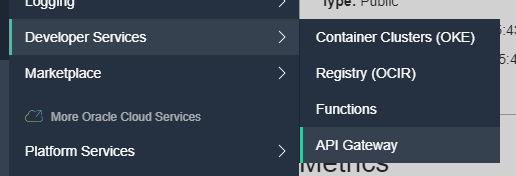

## Wait for OCI CLI and Fn CLI to be installed

You need to provide details on the OCI tenancy you will work in and the OCI user you will work as. Please edit these two files:

* ~/.oci/config
* ~/.oci/oci_api_key.pem

Paste the contents that you prepared in the [OCI Tenancy preparation scenario](https://katacoda.com/redexpertalliance/courses/oci-course/oci-lab-preparation-cloud-trial).

Set the environment variable LAB_ID to 1 - unless you are in a workshop with multiple participants and each uses their own number.

`export LAB_ID=1`{{execute}}

Note: in order to ensure that all workshop participants will have their own individual copies of the function (and more specifically: of the Function's container image on OCI Container Registry), we need to add the participant's LAB_ID to the name of the function.

Do not continue until you see the file `/root/allSetInBackground` appear. If it appears, then the OCI CLI has been installed and you can continue.

Try out the following command to get a list of all namespaces you currently have access to - based on the OCI Configuration defined above.

`oci os ns get`{{execute}} 

If you get a proper response, the OCI is configured correctly and you can proceed. If you run into an error, ask for help from your instructor.

Now please set the Region environment variable using this command:

```
export REGION=$(oci iam region-subscription list | jq -r '.data[0]."region-name"')
export REGION_KEY=$(oci iam region-subscription list | jq -r '.data[0]."region-key"')
export USER_OCID=$(oci iam user list --all | jq -r  '.data |sort_by(."time-created")| .[0]."id"')
```{{execute}}

## Environment Preparation

Prepare a number of environment variables. Note: the assumptions here are a compartment called *lab-compartment*  and an API Gateway *lab-apigw* in that same compartment. We need to get references to these resources in order to create new resources in the right place.  

```
cs=$(oci iam compartment list)
export compartmentId=$(echo $cs | jq -r --arg display_name "lab-compartment" '.data | map(select(."name" == $display_name)) | .[0] | .id')

apigws=$(oci api-gateway gateway list -c $compartmentId)
export apiGatewayId=$(echo $apigws | jq -r --arg display_name "lab-apigw" '.data.items | map(select(."display-name" == $display_name)) | .[0] | .id')
```{{execute}}

And now we are finally ready to create an API Deployment on API Gateway on Oracle Cloud Infrastructure. But let's first inspect the API Gateway that was created in the OCI Tenancy Preparation Scenario.

Open the Console to Developer Services | API Gateway and navigate to the API Gateway *lab-apigw*.


`echo "open the console at https://console.$REGION.oraclecloud.com/api-gateway/gateways/$apiGatewayId"`{{execute}}