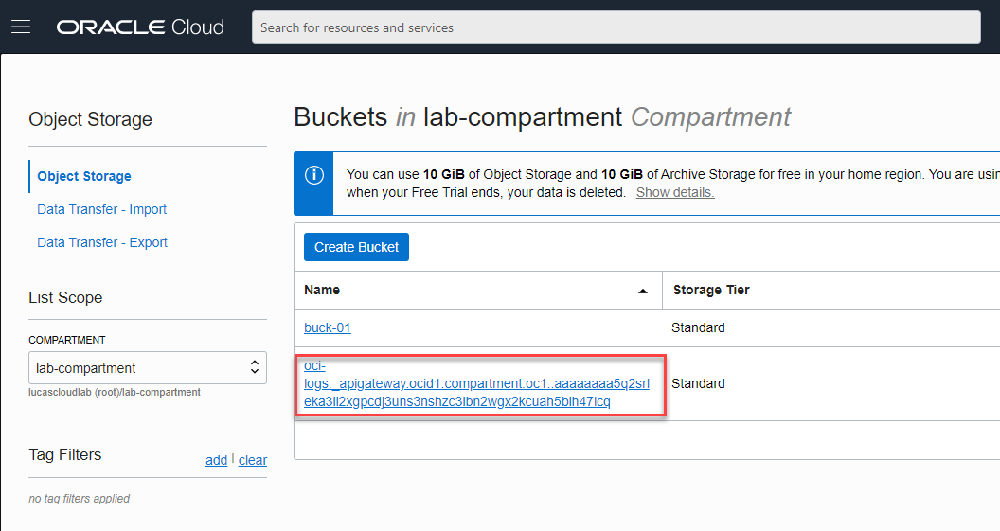
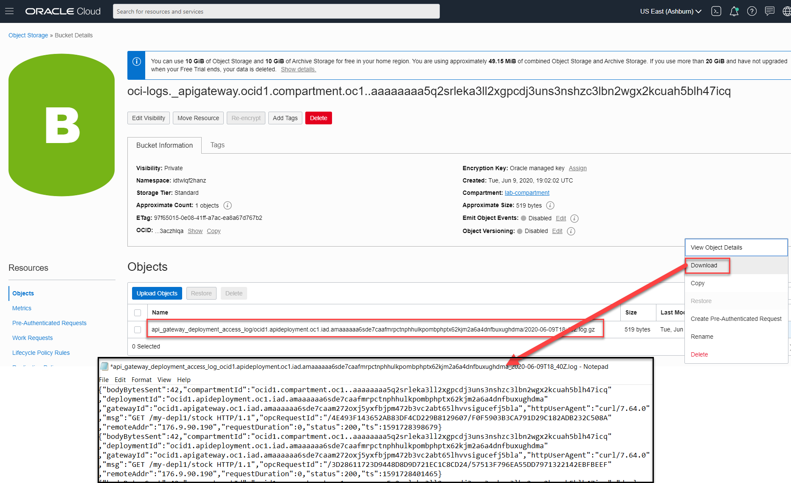

# Creating an API Deployment on an API Gateway on OCI

Let's find out about the API Gateway *lab-apigw* that we will be using in this step:

`oci api-gateway gateway get --gateway-id $apiGatewayId`{{execute}}

There should not be an API Deployment called MY_API_DEPL_$LAB_ID at this stage - because you will be creating that one. Let's list all gateway deployments in the API Gateway:

`oci api-gateway deployment list -c $compartmentId  --gateway-id $apiGatewayId`{{execute}}

Note: if you feel that it is difficult to read the output from these commands, you could consider piping the output to a text file that you can subequently browse in *vi*. For example:

```
oci api-gateway deployment list -c $compartmentId  --gateway-id $apiGatewayId > apiGWDepl
vi apiGWDepl
```{{execute}}

Exit vi using <kbd>Esc</kbd><kbd>:q</kbd>.


Create your own API Deployment - with a single route, to a stock response (a route with a static response object).

Create a file called api_deployment.json in the current directory with this contents. 

`touch api_deployment.json`{{execute}}

Copy the definition of the route */stock* to the api_deployment.json file:

<pre class="file" data-filename="api_deployment.json" data-target="append">
{
  "routes": [
    {
      "path": "/stock",
      "methods": ["GET"],
      "backend": {
        "type": "STOCK_RESPONSE_BACKEND",
        "body": "{\"special_key\":\"Special Value\"}",
        "headers":[],
        "status":200
      }
    }
  ]
}
</pre>

Create the API Deployment in API Gateway lab-apigw with the following command:  

`oci api-gateway deployment create --compartment-id $compartmentId --display-name MY_API_DEPL_$LAB_ID --gateway-id $apiGatewayId --path-prefix "/my-depl$LAB_ID" --specification file://./api_deployment.json`{{execute}}

It will take a few seconds - up to 15-20 seconds - for the new API Deployment to be created. You can check the progress of the creation in the OCI Console.

## Calling an API route on the API Deployment

Now you can invoke the new API [deployment route]. The endpoint for the API Deployment can be retrieved by looking up a list of all API Gateway Deployments, filtering out the one with the desired display_name and grabbing its endpoint. Here the endpoint is copied to the *deploymentEndpoint* environment variable. This variable is used next in the *curl* call.

```
depls=$(oci api-gateway deployment list -c $compartmentId)
deploymentEndpoint=$(echo $depls | jq -r --arg display_name "MY_API_DEPL_$LAB_ID" '.data.items | map(select(."display-name" == $display_name)) | .[0] | .endpoint')
apiDeploymentId=$(echo $depls | jq -r --arg display_name "MY_API_DEPL_$LAB_ID" '.data.items | map(select(."display-name" == $display_name)) | .[0] | .id')

curl $deploymentEndpoint/stock
```{{execute}}

Open the URL shown in the terminal window after executing the next command in a browser:
`echo "Open this URL in your browser or in Postman: $deploymentEndpoint/stock"`{{execute}}


## API Gateway in the OCI Console - Metrics and Logging

Now is a good time to check out the API Deployment on the API Gateway in the OCI Console. The endpoint you can copy and paste into your browser is shown in the terminal window when you execute the next command:

```echo "Your OCI Console Endpoint to inspect your API Deployment: https://console.$REGION.oraclecloud.com/api-gateway/gateways/$apiGatewayId/deployments/$apiDeploymentId"```{{execute}}

Open the OCI Console in your browser. The console page when opened in the browser shows the metrics for the API Deployment. Each call to a route in the API Deployment is recorded, including timestamp, latency and bytes transferred in and out.


Click on the Edit button to bring up the definition of the API Deployment. On the bottom of the first step - *Basic Information* - is a section where API Logging Policies can be configured:
* Enable Access Log setting
* Enable Execution Log setting
* Set Log Level to Information


Press Next - to inspect the Routes. Press Next to see an overview of the entire API deployment definition. Press *Save Changes*. It will take about 10 seconds for the API Deployment to absorb the changes.

Each call from now on is recorded in a log file. The log files are written once every 15 minutes to Object Storage. So after about 15 minutes, a new bucket is created on object storage. Make a few more calls to the Stock API.

```
curl $deploymentEndpoint/stock
```{{execute}}

Check this URL: [https://console.us-ashburn-1.oraclecloud.com/object-storage/buckets] for a new bucket. In that bucket, you will find two objects: the access log file and the execution log file. 

```echo "Your OCI Console Endpoint to inspect the Object Storage buckets: https://console.$REGION.oraclecloud.com/object-storage/buckets"```{{execute}}

When the bucket is created, at least one log file should appear in the bucket, with details about the requests handled by the API Gateway.
 


## Resources

See the documentation on [Deploying an API on an API Gateway by Creating an API Deployment](https://docs.cloud.oracle.com/iaas/Content/APIGateway/Tasks/apigatewaycreatingdeployment.htm) and (Create a Specification)[https://docs.cloud.oracle.com/iaas/Content/APIGateway/Tasks/apigatewaycreatingspecification.htm].
