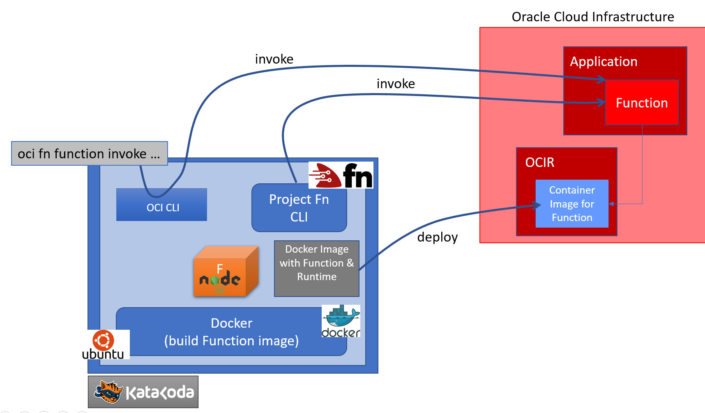

This scenario introduces serverless Functions on Oracle Cloud Infrastructure. It was prepared for the Meetup Workshop Cloud Native application development on Oracle Cloud Infrastructure in January 2020, hosted by AMIS|Conclusion in Nieuwegein in collaboration with REAL (the Red Expert Alliance) and Link from Portugal. It was updated for the REAL OCI Handson Webinar Series that started in June 2020.

The functions are created through Project Fn - using a local CLI. A Function Application is created as a logical container for the functions. Before deployment to the Oracle Cloud Infrastructure, this Application is linked to a Subnet in the VCN (Virtual Cloud Network) to provide a network in which to run the function. The function is then deployed to OCI. Subsequently, you will invoke the function - in several ways:
* using Fn CLI
* using OCI CLI
* using Postman

You can use the OCI Console to verify the creation of application and function and to monitor the calls to the function and inspect the resulting log entries.

The scenario uses an Ubuntu 19.04 environment with Docker, OCI CLI and Fn CLI. Before you can start the steps in the scenario, these two Command Line interfaces are downloaded and installed. This will take about one minute. You will need Postman as well, if you want to invoke the Function directly from your computer.

The scenario works with Node (JS) as runtime language for the function. You can experiment with Java, Go, Ruby, Python as runtimes just as easily.

Note: it is assumed that you prepared an OCI tenancy using the Katacoda scenario [Preparation of Cloud Trial tenancy for REAL OCI scenarios](https://katacoda.com/redexpertalliance/courses/oci-course/oci-lab-preparation-cloud-trial). This preparation will have created the VCN you need for running functions in OCI as well as the *lab-compartment* in which the functions are created. Additionally, you should have created a key pair in this scenario and prepared the contents of the *config* and  *oci_api_key.pem* files. If you have not gone through this OCI tenancy preparation, please do so before continuing with this scenario.