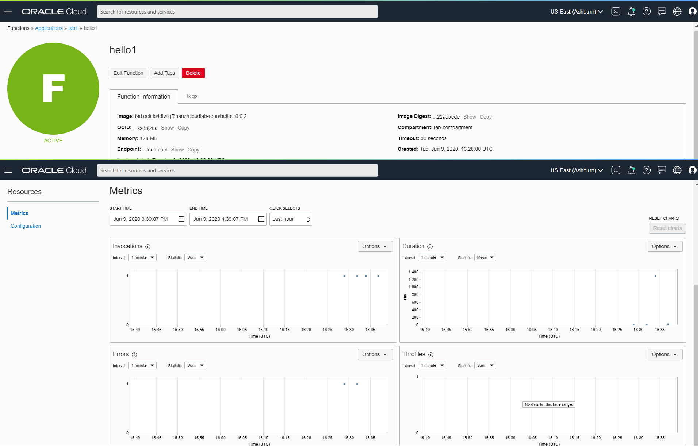

# Creating, Deploying and Invoking a Function on OCI

In this step we will create a simple function with Fn. We pick Node (JS) as our runtime - Go, Python, Java and Ruby are other out of the box options.

Set the environment variable LAB_ID to 1 - unless you are in a workshop with multiple participants and each uses their own number.

`export LAB_ID=1`{{execute}}

Note: in order to ensure that all workshop participants will have their own individual copies of the function (and more specifically: of the Function's container image on OCI Container Registry), we need to add the participant's LAB_ID to the name of the function. 

`fn init --runtime node hello$LAB_ID`{{execute}}

`cd hello$LAB_ID`{{execute}}

Three files have been created in the new directory *hello#*.

`ls`{{execute}}

You could open func.js in the text editor to see the generated functionality. Feel free to edit the file - but please make sure it will execute correctly!

## Create Application

Now create the new application that will be the container for your functions:

`fn create app "lab$LAB_ID" --annotation "oracle.com/oci/subnetIds=[\"$subnetId\"]"`{{execute}}

See the list of applications - that should include your new application:

`fn list apps`{{execute}}

## Deploy the Function

Deploy the Function Hello, into an app that was created beforehand. At this stage a container image is built to host and run the function. This container image is pushed to the Oracle Container Registry on OCR. It is this image that is used to start a container from when the function is (first) invoked.

`fn -v deploy --app "lab$LAB_ID"`{{execute}}

Verify that a Docker Container Image has been built for Fn Function Hello:

`docker images | grep hello`{{execute}}

Optionally, check in the OCI Console if the Container Image has been pushed to the OCI Container Registry: https://console.us-ashburn-1.oraclecloud.com/containers/registry. 

`echo "Open the console at https://console.${REGION,,}.oraclecloud.com/containers/registry"`{{execute}}

Check the list of functions in the application
`fn list f "lab${LAB_ID}"`{{execute}}

Time to invoke the function. The command for invoking the function is simply: `fn invoke <app-name> <function-name>`:

`fn invoke "lab$LAB_ID" hello$LAB_ID`{{execute}}

The first call may take a while because of the cold start of the function. During cold start, the container image is used to start a new container from. If you call the function a second and third time, it is bound to go a lot quicker - because the container will hang a round for a bit. After ten minutes or so of inactivity, the container will be stopped and the next function call after that will suffer again from cold start.

Note: if you get an error message that looks like "Error invoking function. status: 502 message: dhcp options ocid1.dhcpoptions.oc1.iad.ac5aeaq does not exist or Oracle Functions is not authorized to use it", it is probably caused by the fact that:
* the *lab-compartment* does not have a VCN
* or the VCN does not have a public subnet
* or the public subnet does not have an Ingress Rule to allow incoming traffic on port 443
* or the FaaS Service is not granted access to VCN and network resources in *lab-compartment* through a policy

All of the above should have been prepared in the OCI Tenancy Preparation scenario.

To send in a JSON object as input to the function, use the following command:

`echo -n '{"name":"Your Own Name"}' | fn invoke "lab${LAB_ID}" "hello$LAB_ID" --content-type application/json`{{execute}}

Again, a friendly, this time personalized welcome message should be your reward - coming from the cloud.

Check out details for the function you just created and deployed:
`fn inspect f "lab$LAB_ID" "hello$LAB_ID"`{{execute}}

## OCI Console 

Check in the OCI Console if the function shows up there:

[OCI Console | Developer Services | Functions | Applications](https://console.us-ashburn-1.oraclecloud.com/functions)

`echo "Open the console at https://console.${REGION,,}.oraclecloud.com/functions"`{{execute}}

Click on the application that you have just created to see the *hello* function - and inspect the metrics.

