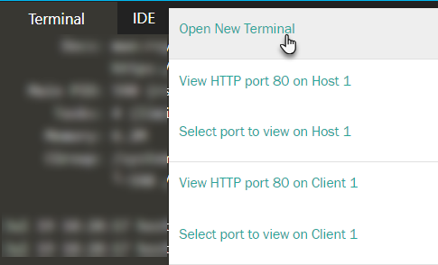

# Creating a Function with Fn 

In this step we will create a simple function with Fn. We pick Node (JS) as our runtime - Go, Python, Java and Ruby are other out of the box options.

`fn init --runtime node hello`{{execute}}

`cd hello`{{execute}}

Three files have been created in the new directory *hello*.

`ls`{{execute}}

The fn init command generated a func.yaml function configuration file; this file provides instructions to the Fn Server to build, deploy and invoke the function. Let's look at the contents:

`cat func.yaml`{{execute}}

The generated func.yaml file contains metadata about your function and declares a number of properties including:

* schema_version--identifies the version of the schema for this function file. Essentially, it determines which fields are present in func.yaml.
* name--the name of the function. Matches the directory name.
* version--automatically starting at 0.0.1.
* runtime--the name of the runtime/language which was set based on the value set in --runtime.
* entrypoint--the name of the Docker execution command to invoke when your function is called, in this case node func.js.
* memory - maximum memory threshold for this function. If this function exceeds this limit during execution, it is stopped and error message is logged. 
* timeout - maximum runtime allowed for this function in seconds. The maximum value is 300 and the default values is 30.

There are other user specifiable properties that can be defined in the yaml file for a function. We do not need those for this simple example. See [Func.yaml metadata options](https://github.com/fnproject/docs/blob/master/fn/develop/func-file.md) for a complete overview of the options for the func.yaml file

The package.json file is present in (most) Node applications: it specifies all the NPM dependencies for your Node function - on third party libraries and also on the Fn FDK for Node (@fnproject/fdk).

`cat package.json`{{execute}}

You could open func.js in the text editor to see the generated functionality of the function: that is where the real action takes place when the function is invoked.

## Deploy and Invoke the Function

Create an Fn application - a container for multiple related functions. 

`fn create app hello-app`{{execute}}

An application acts as a namespace for functions. Some management actions are performed on applications. The number of applications allowed in an OCI tenancy is limited to 10; this number can (potentially) be increased.  

Deploy the Function Hello locally, into the app that was just created

`fn -v deploy --app hello-app --local `{{execute}}

When you deploy a function like this, Fn is dynamically generating a Dockerfile for your function, building a container, and then loading that container for execution when the function is invoked. 

Note: Fn is actually using two images. The first contains the necessary build tools and produces the runtime artefact. The second image packages all dependencies and any necessary language runtime components. Using this strategy, the final function image size can be kept as small as possible.

When using `fn deploy --local`, fn server builds and packages your function into a container image which resides on your local machine. You can now verify that a Docker Container Image has been built for Fn Function Hello:

`docker images | grep hello`{{execute}}

Using the following command, you can check the Fn applications (or function clusters) in your current context:
`fn list apps`{{execute}}

With the next command, you can check which functions have been deployed into a specific application:

`fn list functions hello-app`{{execute}}

Time now to invoke the function. The command for invoking the function is simply: `fn invoke <app-name> <function-name>`:

`fn invoke hello-app hello`{{execute}}

To send in a JSON object as input to the function, use the following command:

`echo -n '{"name":"Your Own Name"}' | fn invoke hello-app hello --content-type application/json`{{execute}}

Again, a friendly, this time personalized, welcome message should be your reward.

What is happening here: when you invoke "hello-app hello" the Fn server looked up the "hello-app" application and then looked for the Docker container image bound to the "hello" function, started the container (if it was not already running) and send the request to the handler listening inside the container.


### Inspect some under-the-hood details

To easily get some understanding of what is happening when you invoke the function, you can use *debug mode* in Fn CLI. Invoke the function with the command prepended with *DEBUG=1*, to get additional debug details on the HTTP requests sent from the Fn CLI to the Fn runtime and received back:

`echo -n '{"name":"Your Own Name"}' | DEBUG=1 fn invoke hello-app hello --content-type application/json`{{execute}}

If you need more clarity on what is happening during the build process that creates the container image, you can use the *verbose* flag- which you need to put immediately after fn:

`fn --verbose build`{{execute}}

## Capturing Logging
When calling a deployed function, Fn captures all standard error output and sends it to a syslog server, if configured. So if you have a function throwing an exception and the stack trace is being written to standard error it’s straightforward to get that stack trace via syslog.

We need to capture the logs for the function so that we can see what happens when it fails. To capture logs you need to configure the tutorial application with the URL of a syslog server. You can do this either when you create an app or after it’s been created.

When creating a new app you can specify the URL using the --syslog-url option. For existing applications, you can use *fn update app* to set the syslog-url setting.

We will quickly grab logging output to a local syslog server. 

Open a second terminal window - for running the syslog server:


Execute the following commands to install the npm module [Simple Syslog Server](https://www.npmjs.com/package/simple-syslog-server), copy a simple node application to run a syslog server based on the npm module and run that application:

```
mkdir /root/syslog
cd /root/syslog
npm install simple-syslog-server
cp /root/scenarioResources/syslog.js .
node syslog.js
```{{execute}}

The syslog server is now running and listening on port 20514 on the TCP protocol.

Switch to the original terminal window. Execute this command to configure application *hello-app* with the now active syslog server:

`fn update app hello-app --syslog-url tcp://localhost:20514`{{execute}}

Time now to invoke the function again and see output being sent to the syslog server

`fn invoke hello-app hello`{{execute}}

Switch to terminal 2 where the syslog server is running and check if the log output from the function was received in the syslog server. 

Perhaps you feel like adding additional log output to the function and see it too being produced to the syslog server. If so, after adding a console.log or console.warn command, (and in the original terminal window) redeploy the function and invoke it again:
```
fn -v deploy --app hello-app --local
fn invoke hello-app hello
```{{execute}}


### Using Papertrail Cloud Service for collecting and inspecting log output 
A more advanced option to use as a log collection server is Papertrail - a SaaS service for log collection and inspection that you can start using for free. Set up a [free Papertrail account](https://papertrailapp.com/signup?plan=free).

On the Papertrail website, go to ‘Settings’ (top right hand corner), click on ‘Log Destinations’, and click ‘Create a Log Destination’.

In the create dialog, under TCP unselect ‘TLS’ and under both TCP and UDP select ‘Plain Text’. Click ‘Create’. You’ll see the address of your log destination displayed at the top of the page looking something like logs7.papertrailapp.com:<PORT>. Copy this value to your clipboard for use in a minute.

`fn update app hello-app --syslog-url tcp://[your Papertrail destination]`

You can confirm that the syslog URL is set correctly by inspecting your application:
`fn inspect app hello-app`{{execute}}

Let’s go over to the Papertrail Dashboard and click on our “System” to open a page with the log showing our function's output.

Resource: https://fnproject.io/tutorials/Troubleshooting/#LogCapturetoaLoggingService


## Wrap existing Node module with Fn Function Wrapper
Suppose you already have Node code performing some valuable task. You can take the existing code and turn it into an Fn Function quite easily - using several approaches even. One is to build a custom Docker container and use it as the implementation for your function (see step 6 in this scenario). An easier one is shown next.

Copy the existing Node application *existingNodeApplication.js* to the folder created for function *hello*:
`cp /root/scenarioResources/existingNodeApp.js /root/hello`{{execute}}

This node application is quite simple, as you can verify:
`cat /root/hello/existingNodeApp.js`{{execute}}

Run the existingNodeApp:
`node existingNodeApp.js YourName`{{execute}}

Note: feel free to make changes to the existingNodeApp.js.

Open the file *func.js* in the text editor. 
`func.js`

Select all current contents (CTRL + A), remove it (Del) and copy this snippet to the file:
<pre class="file" data-target="clipboard">
const fdk=require('@fnproject/fdk');
const app = require( './existingNodeApp.js' );

fdk.handle(function(input){
  let name = 'World';
  if (input.name) {
    name = input.name;
  }
  return {'message': app.doYourThing(name)}
})
</pre>

The function *hello* now leverages the existing Node module *existingNodeApp* for the hard work this function is doing when invoked.

Deploy the Function Hello locally, into the app that was just created
`fn -v deploy --app hello-app --local `{{execute}}

Now to invoke the function:
`echo -n '{"name":"Your Own Name"}' | fn invoke hello-app hello --content-type application/json`{{execute}}

In the response, you will see the product of the *existingNodeApp*. The Fn function *hello* is now completely implemented by *existingNodeApp*. In this case this application is wafer thin, but in real life this can be a sizable Node application that uses scores of NPM modules. This application can be developed and tested in its own right, outside the context of the Fn framework. You have now seen how easy it is to wrap the application in/as a Function. 


## File Writing

If you want to write to a file from a function, it can only be to the local file system (inside the function container) and only to /tmp. Each function is configured with its own /tmp as non-persistent disk space. The size of this disk space is set as part of the function configuration.

Of course, functions can write files on/to storage services - such as Oracle Cloud Object Storage.