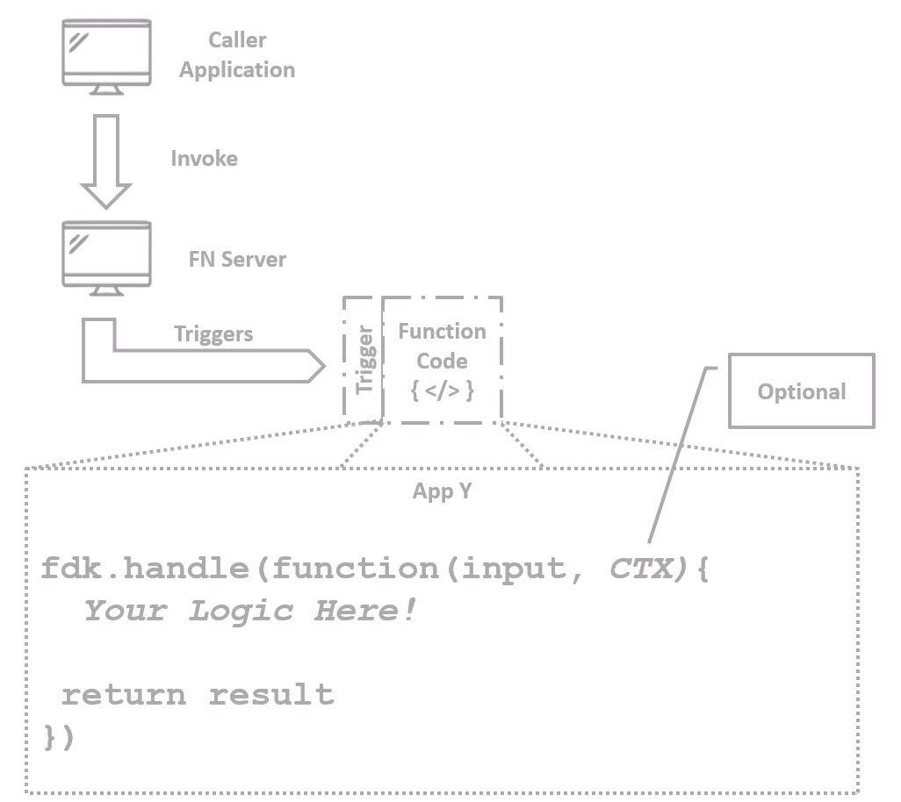

# Invoke Function with CURL 

In this step we will invoke the function with CURL. Subsequently, we will take a look at the context data available to the function when it is handling a request.

## Getting a Function's Invoke Endpoint

In addition to using the Fn invoke command, we can call a function by using a URL. To do this, we must get the function's invoke endpoint. Use the command fn inspect function <appname> <function-name>. To list the hello function's invoke endpoint we can type:

`fn inspect f hello-app hello`{{execute}}

Get the value from the annotation `fnproject.io/fn/invokeEndpoint` in the result of this inspect command. 

You can invoke the function using *curl* at this endpoint. Set an environment variable HELLO_FUNCTION_ENDPOINT with the value of the endpoint.  

`export HELLO_FUNCTION_ENDPOINT=$(fn inspect f hello-app hello | jq -r '.annotations."fnproject.io/fn/invokeEndpoint"')`{{execute}}

Now with the variable set you should be able to invoke the function using curl:

`curl -X "POST" -H "Content-Type: application/json" -d '{"name":"Bob"}' $HELLO_FUNCTION_ENDPOINT`{{execute}}

## Trigger Function Execution (through HTTP)

If we would add a trigger of type *http* to the func.yaml for function hello, we can trigger the execution of a function by triggering the Fn runtime framework.

Open the file `func.yaml` and this snippet at the end of the file:
<pre class="file" data-target="clipboard">
triggers:
- name: hello
  type: http
  source: /hello 
</pre>

Deploy the Function Hello locally, into the app that was just created
`fn -v deploy --app hello-app --local `{{execute}}

Now to invoke the function, we send an HTTP trigger to the Fn runtime server that in turn will send an HTTP request to the container that implements the function :
`curl --data '{"name":"Bob"}' -H "Content-Type: text/plain" -X POST http://localhost:8080/t/hello-app/hello`{{execute}}

## Context available to a Function when processing a Request.

When you invoke a function, the request is handled and forwarded by the Fn Server to the function. This means that an HTTP request is sent to the container that implements the function. This request is received by a handler provided by the Fn FDK for Node. This handler can be seen in the file func.js - which is the generated Node implementation of the function.

Click on the file `func.js` to open it in the editor. On line 3 you see the call `fdk.handle()`. This initializes the Fn Runtime with a generic request handler; when a request is received it is forwarded to the function that is passed to *fdk.handle()* - the function that takes one parameter called *input*.  

Add a second parameter to the function definition on line 3, to make this line read:

<pre class="file" data-target="clipboard">
   fdk.handle(function(input , ctx){
</pre>

The FDK framework's handler (fdk.handle) will now pass the request context in this variable, in addition to the input or payload that was already passed to the function by the handler. 

Change line 8 to make it read: 

<pre class="file" data-target="clipboard">
  return {'message': app.doYourThing(name) ,'ctx':ctx}
</pre>

Changes to file func.js are saved automatically by the editor - do not look for a Save button or use Ctrl+S.

Now we need to redeploy the function with the same command as before:

`fn -v deploy --app hello-app --local `{{execute}}

And invoke it, either through Fn:

`echo -n '{"name":"Your Own Name"}' | fn invoke hello-app hello --content-type application/json`{{execute}}

Or using CURL.

`curl -X "POST" -H "Content-Type: application/json" -H "my-special-header: my-value" -d '{"name":"Johanna"}' $HELLO_FUNCTION_ENDPOINT`{{execute}}

The custom HTTP header in this CURL call should now be visible in the response from the function because it is visible in the context sent to the function by Fn.

By inspecting the *ctx* input parameter, you can make your function interpret the request in a more encompassing way than by only inspecting the input parameter. 

### Detailed Overview of the Function Context
(courtesy of José Rodrigues of Link Consulting)

Context Variable (CTX)
* ctx.config : An Object containing function config variables (from the environment ) (read only)
* ctx.headers : an object containing input headers for the event as lists of strings (read only)
* ctx.deadline : a Date object indicating when the function call must be processed by
* ctx.callID : The call ID of the current call
* ctx.fnID : The Function ID of the current function
* ctx.memory : Amount of ram in MB allocated to this function
* ctx.contentType : The incoming request content type (if set, otherwise null)
* ctx.setResponseHeader(key,values...) : Sets a response header to one or more values
* ctx.addResponseHeader(key,values...) : Appends values to an existing response header
* ctx.responseContentType set/read the response content type of the function (read/write)
* ctx.httpGateway The HTTP Gateway context for this function (if set)

## Resources 
Check out this article for details about the contents of the Fn request context:[Oracle Cloud Infrastructure Functions and Project Fn – Retrieving Headers, Query Parameters and other HTTP Request elements](https://technology.amis.nl/2020/01/02/oracle-cloud-infrastructure-functions-and-project-fn-retrieving-headers-query-parameters-and-other-http-request-elements/)

