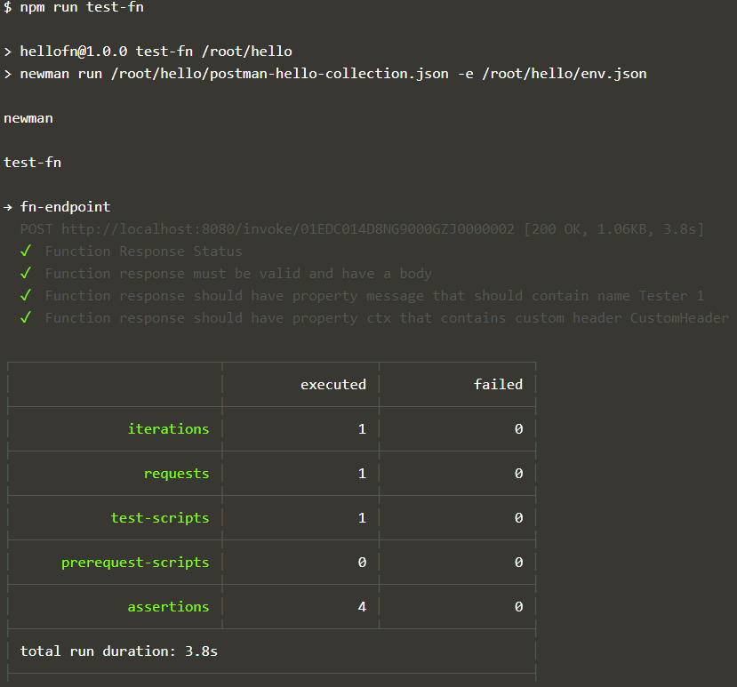

# Test a Function
Originally, the Fn CLI supported the `fn test` command that could run a series of predefined tests on the function. The definition of the tests was the same across all function implementation languages. However, somewhere along the way, this test support was dropped from Fn.

Testing a function is now your own responsibility - and can be done at various levels:
* test the code that implements the function - without invoking the function itself - using appropriate tooling for the relevant programming language
* test the function in its entirety - including the Fn framework - using a mechanism for testing HTTP services (such as Newman)

In order to test the function's implementation without testing the Fn framework, we should ideally implement everything that is specific to the function in a separate module and use the func.js only as the generic wrapper. We can the focus the testing effort on this separate module and all its dependencies.

Install the npm testing module *jest*  (see [jest documentation](https://jestjs.io/docs/en/getting-started.html) for details on how to get started). Jest has rapidly become the industry's choice for testing JavaScript & Node applications.

Execute this command to install *jest* as a development time dependency:

`npm install --save-dev jest`{{execute}}

Add this snippet to `package.json` to have jest invoked whenever *npm test* is executed - creating a new property at the same level as *main* and *dependencies* :
<pre class="file" data-target="clipboard">
,"scripts": {
		"test": "jest"
	  }
</pre>    

Create the test file for module *existingNodeApp*; by convention, this file is typically called *existingNodeApp.test.js*:
`touch existingNodeApp.test.js`{{execute}}

And add the contents to `existingNodeApp.test.js` - which specifies a spectacularly simple test:
<pre class="file" data-target="clipboard">
const app = require( './existingNodeApp.js' );
const name ="Henk"
test(`Simple test for ${name}`, () => {
  expect(app.doYourThing(name)).toBe(`Warm greeting to you, dear ${name} and all your loved ones`);
});
</pre>

Run the test using
`npm test`{{execute}}

This should report favorably on the test of module *existingNodeApp*.

This test of course does not test the Fn framework, the successful creation of the Docker container image and whatever is done inside *func.js*. It tests the core functionality that *existingNodeApp* provides to the wrapper function.

A different type of test could forego the Node implementation and only focus on the HTTP interaction - including the Fn framework and the Container Image. That can be done using a tool such as Newman.

## Service Testing with Newman
Newman is an npm module that is used for running Postman test collections from the command line - and therefore in an automated fashion. See [Running collections on the command line with Newman](https://learning.postman.com/docs/running-collections/using-newman-cli/command-line-integration-with-newman/) for more details on Newman.

Install Newman as Node module:
`npm install --save-dev newman`{{execute}}

Copy these files to the folder with hello function resources. The first file defines a single request to the Hello Function along with a number of tests. This file - defined as a collection in Postman - relies on an environment variable defined in the file env.json. This second file does not exist yet; it will be created from the file env_temp.json. This file defines the variable with the endpoint for the hello function. The value of this variable is taken from the environment variable *$HELLO_FUNCTION_ENDPOINT*. We use the *envsubst* command for this replacement.

```
cp /root/scenarioResources/postman-hello-collection.json /root/hello 
cp /root/scenarioResources/env_temp.json /root/hello 
```{{execute}}

Open file *package.json* in the editor/IDE. Add this script element in the existing *scripts* element:
<pre class="file" data-target="clipboard">
,"test-fn": "newman run /root/hello/postman-hello-collection.json -e /root/hello/env.json"
</pre>
This script is used to run the function test using Newman.

Replace the Hello Function's endpoint and create file *env.json* from the template *env_temp.json*: 
`envsubst < env_temp.json > env.json`{{execute}}

You can check whether file *env.json* now contains the correct function endpoint.
`cat env.json`{{execute}}

To run the test, you can use
`npm run test-fn`{{execute}}

this will run the *test-fn* script as defined in the file package.json that will run *Newman* with the specified collection *postman-hello-collection.json* that was copied in from the scenario assets folder. You should now see confirmation of the tests - defined in the Postman collection and executed by Newman (against the locally deployed Function - invoked through the local Fn framework).




## Performance Testing
We will now briefly look at performance testing the Fn function, using a simple tool called Apache Bench.

Read this article for a very quick introduction of Apache Bench: https://www.petefreitag.com/item/689.cfm

Let's install Apache Bench:
```
apt install apache2-utils
```{{execute}}
and confirm by typing *y*

A simple test of the *hello* function - without supplying any input - looks like this:
`ab -n 100 -c 10 $HELLO_FUNCTION_ENDPOINT`{{execute}}

Here we ask for 100 requests, with a maximum of 10 requests running concurrently.

The tool reports how the response times were distributed. 

A slightly more serious test would involve at least real input. Here we write the POST body to a file and then send that file along in all the test requests:
```
echo -n '{"name":"William Shakespeare"}' > postfile
ab -n 100 -c 10 -T 'application/json' -p postfile $HELLO_FUNCTION_ENDPOINT 
```{{execute}}

It seems that if you run the test again, the results are quite a lot faster. Give it a try.


