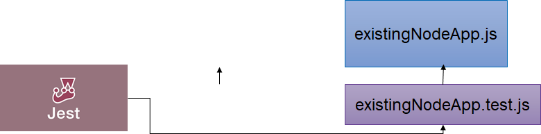
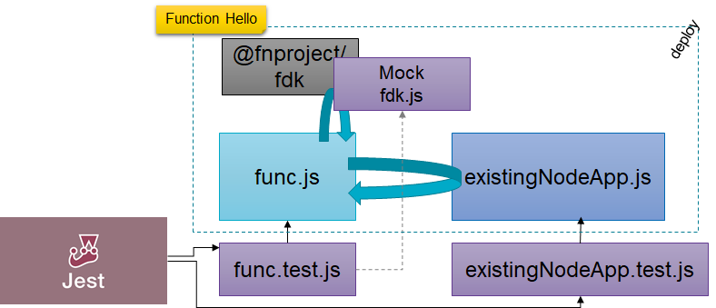
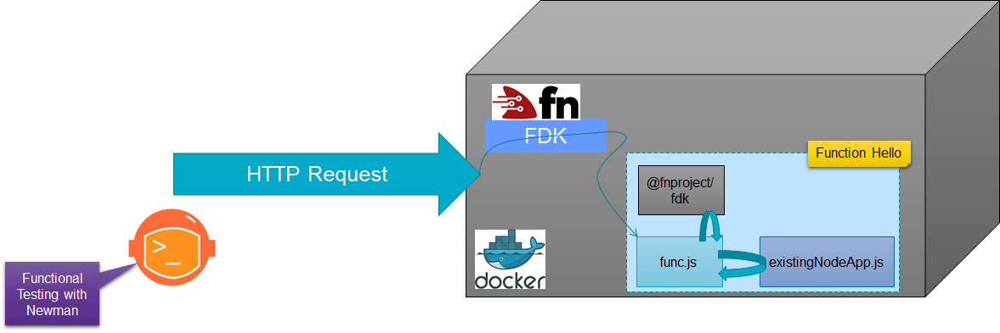
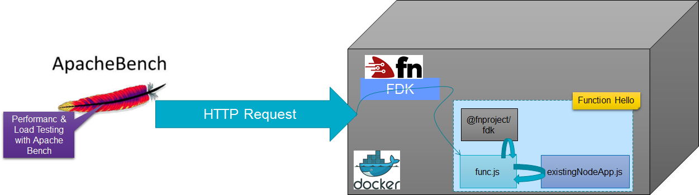

# Test a Function
Originally, the Fn CLI supported the `fn test` command that could run a series of predefined tests on the function. The definition of the tests was the same across all function implementation languages. However, somewhere along the way, this test support was dropped from Fn.

Testing a function is now your own responsibility - and can be done at various levels:
* test the code that implements the function - without invoking the function itself - using appropriate tooling for the relevant programming language
* test the function in its entirety - including the Fn framework - using a mechanism for testing HTTP services (such as Newman)

In order to test the function's implementation without testing the Fn framework, we should ideally implement everything that is specific to the function in a separate module and use the func.js only as the generic wrapper. We can the focus the testing effort on this separate module and all its dependencies.

Install the npm testing module *jest*  (see [jest documentation](https://jestjs.io/docs/en/getting-started.html) for details on how to get started). Jest has rapidly become the industry's choice for testing JavaScript & Node applications.

Execute this command to install *jest* as a development time dependency:

`npm install --save-dev jest`{{execute}}

Add this snippet to `package.json` to have jest invoked whenever *npm test* is executed - creating a new property at the same level as *main* and *dependencies* :
<pre class="file" data-target="clipboard">
,"scripts": {
		"test": "jest"
	  }
</pre>    

Create the test file for module *existingNodeApp*; by convention, this file is typically called *existingNodeApp.test.js*:
`touch existingNodeApp.test.js`{{execute}}

And add the contents to `existingNodeApp.test.js` - which specifies a spectacularly simple test:
<pre class="file" data-target="clipboard">
const app = require( './existingNodeApp.js' );
const name ="Henk"
test(`Simple test for ${name}`, () => {
  expect(app.doYourThing(name)).toBe(`Warm greeting to you, dear ${name} and all your loved ones`);
});
</pre>

Run the test using
`npm test`{{execute}}

This should report favorably on the test of module *existingNodeApp*.

This test of course does not test the Fn framework, the successful creation of the Docker container image and whatever is done inside *func.js*. It tests the core functionality that *existingNodeApp* provides to the wrapper function.

We can go one step further, and test *func.js* as well - still before the function is deployed to a container. We will use Jest - and in particular the mocking capabilities of Jest. The function - func.js - uses the Fn FDK framework - to handle HTTP requests that are handed to the function for procesing. However, in the test situation, we want to test outside the scope and context of the Fn framework. This can be done by using a mock for the fdk module. Jest allows us to define a mock in the following way :

* create file fdk.js in the folder __mocks__/@fnproject under the hello function
* implement the mock version of module @fnproject/fdk with a mock version of function *handle*
* create file func.test.js that uses module @fnproject/fdk and runs tests against *func.js* 



Create the new file for implementing the mock fdk.js:  
```
mkdir /root/hello/__mocks__
mkdir /root/hello/__mocks__/@fnproject
touch /root/hello/__mocks__/@fnproject/fdk.js
```{{execute}}

Open the new file fdk.js in the IDE. Copy this code snippet to the file.
<pre class="file" data-target="clipboard">
const handle = function (f) {
    theFunction = f
    return f
}
let theFunction
const functionCache = function getFunction() {    
    return theFunction
}

exports.handle = handle
exports.functionCache = functionCache
</pre>
When the func.js is required, it invokes function *handle* on the *fdk* module and passes a function as input parameter. This function is the actual Fn function implementation that handles the input and context objects to the Fn function. In the case of the mock fdk module, the *handle* function will simply retain the function reference in local variable *theFunction*. 

The test function invokes *functionCache* to retrieve the handle to this function and subsequently invoke it - just as it would be in case of the normal invocation of the Fn function.

Create the file for the Jest tests for module *func*:

```
touch /root/hello/func.test.js
```{{execute}}

Copy the following snippet to this file:

<pre class="file" data-target="clipboard">
// simply require func.js registers the function (input, context) with mock fdk
const func = require( './func.js' );
const fdk=require('@fnproject/fdk');
const name ="Bob"
const input = {"name":name}
const context = {"_headers":{"Host":"localhost","Content-Type":"application/json"}}
const theFunction = fdk.functionCache() // get the function that was registered in func.js with the (mock) fdk handler
test(`Test of func.js for ${name}`, () => {
  expect(theFunction(input,context).message)
  .toBe(`Warm greeting to you, dear ${name} and all your loved ones`);
});
test(`Test of func.js for Host header in context object`, () => {
  expect(theFunction(input,context).ctx._headers.Host)
  .toBe(`localhost`);
});
</pre>

The story for this test: the test loads the object to test - *func.js* - and the mock for the Fn FDK. The require of *func.js* causes the call in func.js to fdk.handle() to take place; this loads the reference to function object defined in func.js in the functionCache. The test gets the reference to the function in the local variable *theFunction*. Two tests are defined:
* when the function is invoked with an object that contains a *name* property, does the response object contain a *message* property that has the specified value?
*  when the function is invoked with a second object - *context* - does the response contain a *ctx* object 

Run the test using
`npm test`{{execute}}

This should report favorably on the test of module *existingNodeApp* and the two tests for module *func*, the real function implementation - but still without the runtime interference of Fn.

A different type of test could forego the Node implementation and only focus on the HTTP interaction - including the Fn framework and the Container Image. That can be done using a tool such as Newman.

## Service Testing with Newman
Newman is an npm module that is used for running Postman test collections from the command line - and therefore in an automated fashion. See [Running collections on the command line with Newman](https://learning.postman.com/docs/running-collections/using-newman-cli/command-line-integration-with-newman/) for more details on Newman.


Install Newman as Node module:
`npm install --save-dev newman`{{execute}}

Copy these files to the folder with hello function resources. The first file defines a single request to the Hello Function along with a number of tests. This file - defined as a collection in Postman - relies on an environment variable defined in the file env.json. This second file does not exist yet; it will be created from the file env_temp.json. This file defines the variable with the endpoint for the hello function. The value of this variable is taken from the environment variable *$HELLO_FUNCTION_ENDPOINT*. We use the *envsubst* command for this replacement.

```
cp /root/scenarioResources/postman-hello-collection.json /root/hello 
cp /root/scenarioResources/env_temp.json /root/hello 
```{{execute}}

Open file *package.json* in the editor/IDE. Add this script element in the existing *scripts* element:
<pre class="file" data-target="clipboard">
,"test-fn": "newman run /root/hello/postman-hello-collection.json -e /root/hello/env.json"
</pre>
This script is used to run the function test using Newman.

Replace the Hello Function's endpoint in template file env_temp.json and produce file *env.json* from the template *env_temp.json* with the replaced value: 
`envsubst < env_temp.json > env.json`{{execute}}

You can check whether file *env.json* now contains the correct function endpoint.
`cat env.json`{{execute}}

To run the test, you can use
`npm run test-fn`{{execute}}

this will run the *test-fn* script as defined in the file package.json that will run *Newman* with the specified collection *postman-hello-collection.json* that was copied in from the scenario assets folder. You should now see confirmation of the tests - defined in the Postman collection and executed by Newman (against the - locally - deployed Function - invoked through the local Fn framework).


Check the contents of the file `postman-hello-collection.json` - in the IDE or on the terminal:
`cat postman-hello-collection.json`{{execute}}

The json file contains a single request - to the Hello function - with a body and a header. It also defines four tests that the function's HTTP result should conform with. Note: the *language* used for defining the test conditions is described here in the [Chai BDD Assertion Library](https://www.chaijs.com/api/bdd/). Feel free to edit the test definitions in the file.

```
"pm.test(\"Function Response Status\", function () {\r",
"    pm.response.to.have.status(200);\r",
"});\r",
"pm.test(\"Function response must be valid and have a body\", function () {\r",
"     pm.response.to.be.ok;\r",
"     pm.response.to.be.withBody;\r",
"     pm.response.to.be.json;\r",
"});\r",
"pm.test(\"Function response should have property message that should contain name Tester 1\", function () {\r",
"      const jsonData = pm.response.json();\r",
"      pm.expect(jsonData).to.have.property('message');\r",
"      pm.expect(jsonData.message).to.include('Tester 1');\r",
"  });\r",
"pm.test(\"Function response should have property ctx that contains custom header CustomHeader\", function () {\r",
"      const jsonData = pm.response.json();\r",
"      pm.expect(jsonData.ctx).to.have.property('_headers');\r",
"      pm.expect(jsonData.ctx[\"_headers\"]).to.have.deep.property('Custom-Header');\r",
"  });  "
```


## Performance Testing
We will now briefly look at performance testing the Fn function, using a simple tool called Apache Bench.


Read this article for a very quick introduction of Apache Bench: https://www.petefreitag.com/item/689.cfm

Let's install Apache Bench:
```
apt install apache2-utils
```{{execute}}
and confirm by typing *y*

A simple test of the *hello* function - without supplying any input - looks like this:
`ab -n 100 -c 10 $HELLO_FUNCTION_ENDPOINT`{{execute}}

Here we ask for 100 requests, with a maximum of 10 requests running concurrently.

The tool reports how the response times were distributed. 

A slightly more serious test would involve at least real input. Here we write the POST body to a file and then send that file along in all the test requests:
```
echo -n '{"name":"William Shakespeare"}' > postfile
ab -n 100 -c 10 -T 'application/json' -p postfile $HELLO_FUNCTION_ENDPOINT 
```{{execute}}

It seems that if you run the test again, the results are quite a lot faster. Give it a try.


