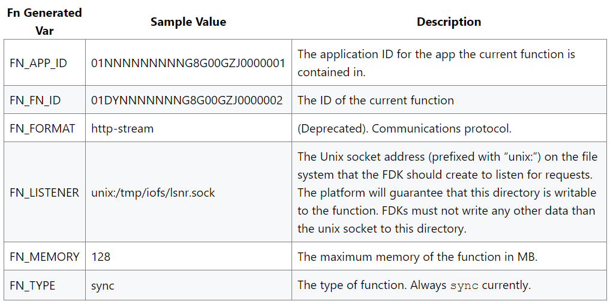

# Passing Context Values to a Function

Fn config variables can be set for applications or functions. In addition, Fn automatically generates a number of environment variables for your use.

* Application Config Variables: Variables stored in an application are available to all functions that are deployed to that application.
* Function Config Variables: Variables stored for a function are only available to that function.
* Pre-defined environment variables: By default, a number of environment variables are automatically generated in an Fn Docker image. The next figure show the automatically generated variables.

