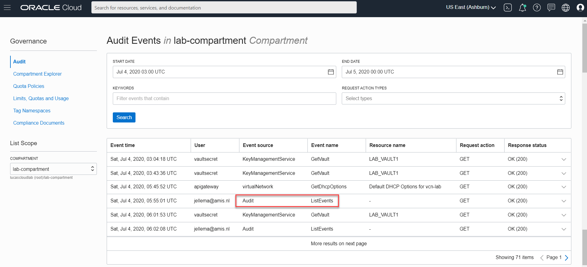

The Audit service collects data on all requests handled by the OCI REST APIs. Since all access to the Oracle Cloud Infrastructure resources goes through the REST APIs, this means that Audit knows everything: every creation or change or even read action against any resources - from Compute Instance to Storage Bucket and from any Function to every Alarm. Note: for tables in NoSQL Database, Audit will record changes to the table definitions, not every operation on every record in the table.

This command will get you the first page of AuditEvents collected in the last 30 minutes. There is currently no way in the CLI to filter the audit events returned by type of event or the OCI service involved.
`oci audit event list --compartment-id $compartmentId --end-time $(date --iso-8601=seconds)  --start-time $(date -d "-30 minutes" --iso-8601=seconds)`{{execute}}

You may want to send the output from the *oci audit event list* command to a file, for easier inspection: 
`oci audit event list --compartment-id $compartmentId --all --stream-output --end-time $(date --iso-8601=seconds)  --start-time $(date -d "-30 minutes" --iso-8601=seconds) > audit.log`{{execute}}
The file that is produced can be substantial - especially of course in a tenancy with lots of activity.
`ls -l audit.log`{{execute}}

You can open the file and further explore the findings:
`audit.log`{{open}}

It may be easier to explore and analyze Audit Events in the OCI Console. Open the Audit explorer at:
`echo "Open the Audit Explorer at https://console.$REGION.oraclecloud.com/audit/events"`{{execute}}


Description of the audit events in the response can be found in (the API documentation on AuditEvent)[https://docs.cloud.oracle.com/en-us/iaas/api/#/en/audit/20200901/AuditEvent/].

An example of an AuditEvent for a GET request to the Compute service is shown here:
```
{
  "eventType": "com.oraclecloud.ComputeApi.GetInstance",
  "cloudEventsVersion": "0.1",
  "eventTypeVersion": "2.0",
  "source": "ComputeApi",
  "eventId": "<unique_ID>",
  "eventTime": "2020-09-18T00:10:59.252Z",
  "contentType": "application/json",
  "data": {
    "eventGroupingId": null,
    "eventName": "GetInstance",
    "compartmentId": "ocid1.tenancy.oc1..<unique_ID>",
    "compartmentName": "compartmentA",
    "resourceName": "my_instance",
    "resourceId": "ocid1.instance.oc1.phx.<unique_ID>",
    "availabilityDomain": "",
    "freeformTags": null,
    "definedTags": null,
    "identity": {
      "principalName": "ExampleName",
      "principalId": "ocid1.user.oc1..<unique_ID>",
      "authType": "natv",
      "callerName": null,
      "callerId": null,
      "tenantId": "ocid1.tenancy.oc1..<unique_ID>",
      "ipAddress": "172.24.80.88",
      "credentials": null,
      "userAgent": "Jersey/2.23 (HttpUrlConnection 1.8.0_212)",
      "consoleSessionId": null
    },
    "request": {
      "id": "<unique_ID>",
      "path": "/20160918/instances/ocid1.instance.oc1.phx.<unique_ID>",
      "action": "GET",
      "parameters": {},
      "headers": {
        "opc-principal": [
          "{\"tenantId\":\"ocid1.tenancy.oc1..<unique_ID>\",\"subjectId\":\"ocid1.user.oc1..<unique_ID>\",\"claims\":[{\"key\":\"pstype\",\"value\":\"natv\",\"issuer\":\"authService.oracle.com\"},{\"key\":\"h_host\",\"value\":\"iaas.r2.oracleiaas.com\",\"issuer\":\"h\"},{\"key\":\"h_opc-request-id\",\"value\":\"<unique_ID>\",\"issuer\":\"h\"},{\"key\":\"ptype\",\"value\":\"user\",\"issuer\":\"authService.oracle.com\"},{\"key\":\"h_date\",\"value\":\"Wed, 18 Sep 2020 00:10:58 UTC\",\"issuer\":\"h\"},{\"key\":\"h_accept\",\"value\":\"application/json\",\"issuer\":\"h\"},{\"key\":\"authorization\",\"value\":\"Signature headers=\\\"date (request-target) host accept opc-request-id\\\",keyId=\\\"ocid1.tenancy.oc1..<unique_ID>/ocid1.user.oc1..<unique_ID>/8c:b4:5f:18:e7:ec:db:08:b8:fa:d2:2a:7d:11:76:ac\\\",algorithm=\\\"rsa-pss-sha256\\\",signature=\\\"<unique_ID>\\\",version=\\\"1\\\"\",\"issuer\":\"h\"},{\"key\":\"h_(request-target)\",\"value\":\"get /20160918/instances/ocid1.instance.oc1.phx.<unique_ID>\",\"issuer\":\"h\"}]}"
        ],
        "Accept": [
          "application/json"
        ],
        "X-Oracle-Auth-Client-CN": [
          "splat-proxy-se-02302.node.ad2.r2"
        ],
        "X-Forwarded-Host": [
          "compute-api.svc.ad1.r2"
        ],
        "Connection": [
          "close"
        ],
        "User-Agent": [
          "Jersey/2.23 (HttpUrlConnection 1.8.0_212)"
        ],
        "X-Forwarded-For": [
          "172.24.80.88"
        ],
        "X-Real-IP": [
          "172.24.80.88"
        ],
        "oci-original-url": [
          "https://iaas.r2.oracleiaas.com/20160918/instances/ocid1.instance.oc1.phx.<unique_ID>"
        ],
        "opc-request-id": [
          "<unique_ID>"
        ],
        "Date": [
          "Wed, 18 Sep 2020 00:10:58 UTC"
        ]
      }
    },
    "response": {
      "status": "200",
      "responseTime": "2020-09-18T00:10:59.278Z",
      "headers": {
        "ETag": [
          "<unique_ID>"
        ],
        "Connection": [
          "close"
        ],
        "Content-Length": [
          "1828"
        ],
        "opc-request-id": [
          "<unique_ID>"
        ],
        "Date": [
          "Wed, 18 Sep 2020 00:10:59 GMT"
        ],
        "Content-Type": [
          "application/json"
        ]
      },
      "payload": {
        "resourceName": "my_instance",
        "id": "ocid1.instance.oc1.phx.<unique_ID>"
      },
      "message": null
    },
    "stateChange": {
      "previous": null,
      "current": null
    },
    "additionalDetails": {
      "imageId": "ocid1.image.oc1.phx.<unique_ID>",
      "shape": "VM.Standard1.1",
      "type": "CustomerVmi"
    }
  }
}
```