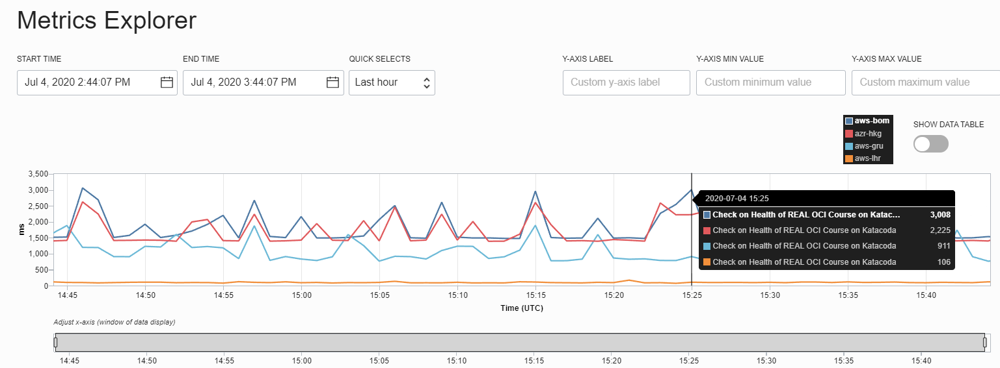
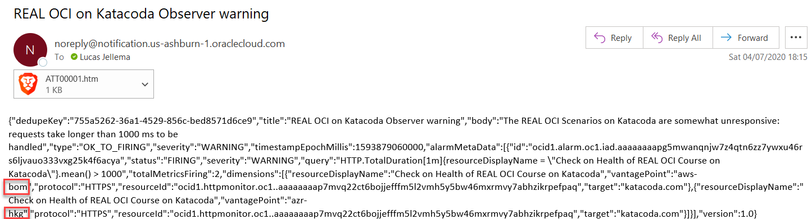
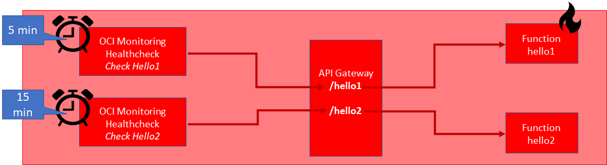

Health Checks are automated evaluations of the response provided from endpoints under scrutiny, from observation points throughout the world. Using health checks, we can continuously establish whether a service is a available at all, if it returns a success status and how fast it is responding - measured from various global regions. This gives us a good understanding of latency experiences by our consumers in several areas of the world (and may give inspiration for a CDN or a more regional distribution of our services).

Health Checks can be one time only (called probes) or scheduled to execute periodically (for example every 30 seconds or every 5 minutes). Results are gathered in the OCI metrics *data lake* and inspected in the console and through the CLI and API. Additionally, alarms can be defined on the Health Check metrics, publishing a notification for example when an endpoint is not available or the overall HTTP processing  time is longer than the specified threshold.  

In this step, you will create a one time health probe and inspect its findings. Next, you will create a Health Check that runs every minute and publishes its findings as metrics. Then you will create an alarm on the findings, with some impossibly challenging threshold in order to get a result from that alarm.

## One Time only Health Probe
List all vantage points that can be specifid in health checks:
`oci health-checks vantage-point list --all`{{execute}}

This command creates a one time health probe - a quick evaluation of the current status of the end point *katacoda.com/redexpertalliance/courses/oci-course* from four vantage points: Hong Kong (Azure), London (AWS), Mumbai (AWS) and São Paulo (AWS)
```
healthprobe=$(oci health-checks http-probe create-on-demand --compartment-id=$compartmentId --targets="[\"katacoda.com\"]" --method=GET --path="/redexpertalliance/courses/oci-course"  --port=443 --protocol=HTTPS --vantage-point-names="[\"azr-hkg\", \"aws-lhr\", \"aws-bom\", \"aws-gru\"]")
healthProbeId=$(echo $healthprobe | jq -r  '.data | .id')
echo $healthprobe
echo $healthProbeId
```

To see the results of the probe, wait a few seconds, then check for the probe's findings using:
`oci health-checks http-probe-result list --probe-configuration-id=$healthProbeId`{{execute}}

## Health Check 
Create a Healthcheck on the web page for the OCI handson scenarios created on Katacoda by the Red Expert Alliance; check once per minute what the health is of the site: 

`oci health-checks http-monitor create --compartment-id=$compartmentId --display-name="Check on Health of REAL OCI Course on Katacoda" --interval-in-seconds=60 --targets="[\"katacoda.com\"]" --method=GET --path="/redexpertalliance/courses/oci-course"  --port=443 --protocol=HTTPS --vantage-point-names="[\"azr-hkg\", \"aws-lhr\", \"aws-bom\", \"aws-gru\"]"`{{execute}}

Findings for the health check take about one minute to become available. They can be inspected in the console and through queries to the monitoring API. This statement returns all health check metrics - grouped by vantage point. 

`oci monitoring metric-data summarize-metrics-data --compartment-id=$compartmentId --namespace="oci_healthchecks" --query-text="HTTP.TotalDuration[1m]{resourceDisplayName = \"Check on Health of REAL OCI Course on Katacoda\"}.mean()"`{{execute}}

When you inspect the metrics, there can be substantial differences between the values found for different vantage points.

The next chart shows measurements during a one hour period - for each of four vantage points. This might give you a clue to the physical location of the Katacoda servers. 



## Alarm on the Health Check Status
Create an alarm, associated with the *lab-notification-topic-$LAB_ID* notification topic and triggered by poor response times experienced by the healthcheck:
```
oci monitoring alarm create --compartment-id=$compartmentId --destinations="[\"$ONS_TOPIC_OCID\"]"  --display-name="REAL OCI on Katacoda Observer warning" --metric-compartment-id=$compartmentId --namespace="oci_healthchecks"  --query-text="HTTP.TotalDuration[1m]{resourceDisplayName = \"Check on Health of REAL OCI Course on Katacoda\"}.mean() > 1000"  --severity="WARNING" --body="The REAL OCI Scenarios on Katacoda are somewhat unresponsive: requests take longer than 1000 ms to be handled" --pending-duration="PT1M"  --resolution="1m" --is-enabled=true
```{{execute}}

With this alarm in place, it is expected that because of the findings from some of the vantage points there will be warnings published to the notification topic. Because in step 5 you subscribed your email address to the notification topic, these warning will result in emails in your mailbox.


## Bonus: Hot Functions

Imagine - or even implement - the following scenario:

* create and deploy two functions to OCI - just the default, hello world template is enough
* create routes for both functions on the API Gateway
* create two health checks - one for each route and function ; set the interval time for one health check at 5 minutes, the other at 15 minutes
* after one hour or longer, compare the average processing time for the two health checks. Remember that the functions are the same - as well was the way they are deployed and exposed. What can be the cause for any (substantial) differences in the findings between the health checks?


## Resources
[OCI Documentation on Health Checks](https://docs.cloud.oracle.com/en-us/iaas/Content/HealthChecks/Concepts/healthchecks.htm)