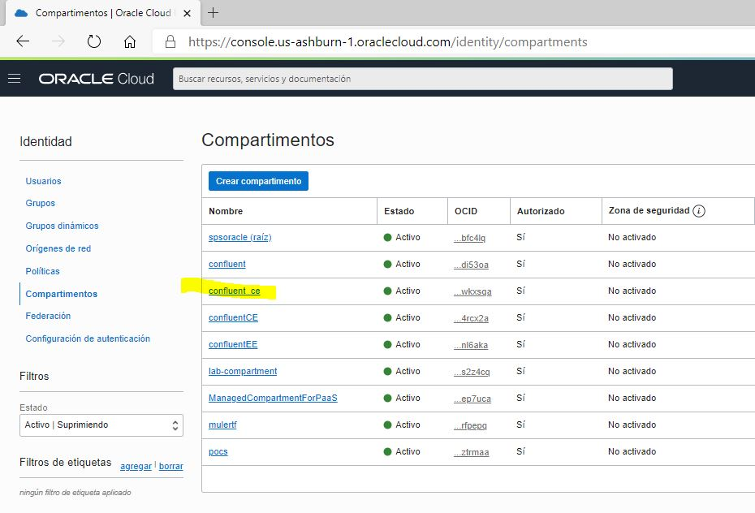

Some of the steps in this scenario require the use of the OCI Command Line Interface. 

Execute the following command to install the OCI CLI:
```
curl -L https://raw.githubusercontent.com/oracle/oci-cli/master/scripts/install/install.sh > install-oci-cli.sh
chmod +777 install-oci-cli.sh
sudo ./install-oci-cli.sh --accept-all-defaults

# add this line to ~/.profile - to make oci a recognized shell command
echo 'oci() { /root/bin/oci "$@"; }' >> ~/.profile
# reload ~/.profile
. /root/.profile

```{{execute}}

You need to provide details on the OCI tenancy you will work in and the OCI user you will work as. Please open the IDE tab and edit these two files:

* ~/.oci/config
* ~/.oci/oci_api_key.pem

Paste the contents that you prepared in the [OCI Tenancy preparation scenario](https://katacoda.com/redexpertalliance/courses/oci-course/oci-lab-preparation-cloud-trial). 

### Finalizing the Environment 

Set the environment variable LAB_ID to 1 - unless you are in a workshop with multiple participants and each uses their own number.

`export LAB_ID=1`{{execute}}

Try out the following command to get a list of all namespaces you currently have access to - based on the OCI Configuration defined above.

`oci os ns get`{{execute}} 

If you get a proper response, the OCI is configured correctly and you can proceed. If you run into an error, ask for help from your instructor.

## Environment Preparation

```
export REGION=$(oci iam region-subscription list | jq -r '.data[0]."region-name"')
export REGION_KEY=$(oci iam region-subscription list | jq -r '.data[0]."region-key"')
export USER_OCID=$(oci iam user list --all | jq -r  '.data |sort_by(."time-created")| .[0]."id"')
export TENANCY_OCID=$(oci iam user list --all | jq -r  '.data[0]."compartment-id"') 
cs=$(oci iam compartment list)
export compartmentId=$(echo $cs | jq -r --arg display_name "lab-compartment" '.data | map(select(."name" == $display_name)) | .[0] | .id')

# get namespace
nss=$(oci os ns get)
export ns=$(echo $nss | jq -r '.data')

```{{execute}}

## Create compartment to organize the Kafka Confluent resources that you will deploy. 

Create a compartment with the name confluent_ce (confluent community edition)

`export confluent_compartment=confluent_ce`{{execute}}


```
compartment=$(oci iam compartment create --compartment-id "$TENANCY_OCID"  --name "$confluent_compartment" --description "Compartment for resources for Confluent Community Edition")
echo "JSON response from the command to create the compartment:"
echo $compartment
compartmentId=$(echo $compartment | jq --raw-output .data.id)
echo The OCID for the compartment is:  $compartmentId
```{{execute}}

To set an environment variable $compartmentId fetch the OCID from the compartment with this command (this also works when the compartment already existed prior to running this scenario):
```
cs=$(oci iam compartment list)
export compartmentId=$(echo $cs | jq -r --arg display_name "$confluent_compartment" '.data | map(select(."name" == $display_name)) | .[0] | .id')
```{{execute}}

In your OCI console you will see the new compartment created:



Now let's prepare Terraform in the next Step.

