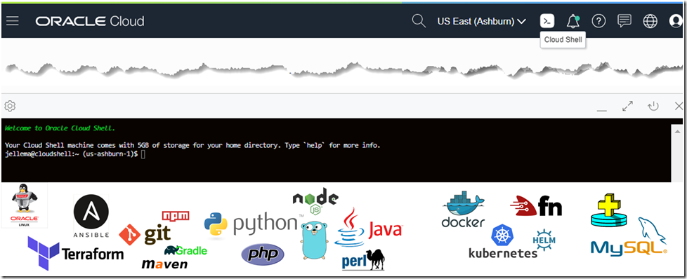

# Let's test our new Kafka Confluent cluster running on OCI

Let's get the Public IP address from one of the broker servers:

```
export ADOMAINS=$(oci iam availability-domain list --compartment-id $compartmentId)
export DISPLAY_NAME=broker-1
export AVAILABILITY_DOM=$(echo $ADOMAINS | jq -r '.data | .[0] | .name')
export INSTANCE_DETAILS=$(oci compute instance list --compartment-id $compartmentId --availability-domain $AVAILABILITY_DOM --display-name $DISPLAY_NAME)
export INSTANCE_ID=$(echo $INSTANCE_DETAILS | jq -r '.data | .[0] | .["id"]')
export instance_vnics=$(oci compute instance list-vnics --instance-id $INSTANCE_ID)
export broker1_public_ip=$(echo $instance_vnics | jq -r '.data | .[0] | .["public-ip"]')
```{{execute}}

And to validate that we've retrieved it properly, execute:

`echo "The IP address of the broker-1 instance is: $broker_public_ip"`{{execute}}

From this point we will have to use the cloud shell from your OCI Console.
Open the OCI Cloud Shell tool, from the OCI Cloud Console.



Now that you are in cloud shell, you will have to copy the contents of your **/root/keys/confluent** private key and create a file with the name confluent 
in the OCI cloud shell in order to make ssh to the broker0 compute instance.

`more /root/keys/confluent`{{execute}}

**(Copy the content of the previous output and create a file in cloud shell in the home directory, with the name confluent and paste what you've copied**


Change permissions to the file you've created to:

<pre class="file" data-target="clipboard">
chmod 600 confluent
</pre>


Copy and paste the following commands, just replace the values of the **$broker1_public_ip** on your environment:

<pre class="file" data-target="clipboard">
ssh -i confluent opc@$broker1_public_ip
</pre>


Now that you've entered into the broker1 server, let's create a first demo topic (copy the following command and paste it in cloudshell):

<pre class="file" data-target="clipboard">
/usr/bin/kafka-topics --zookeeper zookeeper-0:2181 --create --topic katacodademo --partitions 1 --replication-factor 3
</pre>


Now let's publish a message into it (copy the following command and paste it in cloudshell):

<pre class="file" data-target="clipboard">
curl --location --request POST 'http://rest-0:8082/topics/katacodademo1' \
--header 'Content-Type: application/vnd.kafka.binary.v2+json' \
--header 'Accept: application/vnd.kafka.v2+json, application/vnd.kafka+json, application/json' \
-d '{
  "records": [
    {
      "key": "myKey",
      "value": "my key value"
    },
    {
      "value": "value1",
      "partition": 0
    },
    {
      "value": "value2"
    }
  ]
}'
</pre>


You shoud had received something like this as a response:
~~~~
{
   "offsets":[
      {
         "partition":0,
         "offset":0,
         "error_code":null,
         "error":null
      },
      {
         "partition":0,
         "offset":1,
         "error_code":null,
         "error":null
      },
      {
         "partition":0,
         "offset":2,
         "error_code":null,
         "error":null
      }
   ],
   "key_schema_id":null,
   "value_schema_id":null
}
~~~~

Also if you want to get the partitions from your newly created katacoda topic, you can try (copy the following command):

<pre class="file" data-target="clipboard">
curl --location --request GET 'http://rest-0:8082/topics/katacodademo/partitions'
</pre>

Or post a message to partition (copy the following command):

<pre class="file" data-target="clipboard">
curl --location --request POST 'http://rest-0:8082/topics/katacodademo/partitions/0/' \
--header 'Content-Type: application/vnd.kafka.binary.v2+json' \
--header 'Accept: application/vnd.kafka.v2+json, application/vnd.kafka+json, application/json' \
--data-raw '{
  "records": [
    {
      "key": "a2V5",
      "value": "Y29uZmx1ZW50"
    },
    {
      "value": "a2Fma2E="
    }
  ]
}'
</pre>

And you can try all the basic functionality from your newly created cluster.

Now let's move into the next step, to show you how with terraform we can destroy all the resources that we have provisioned.
