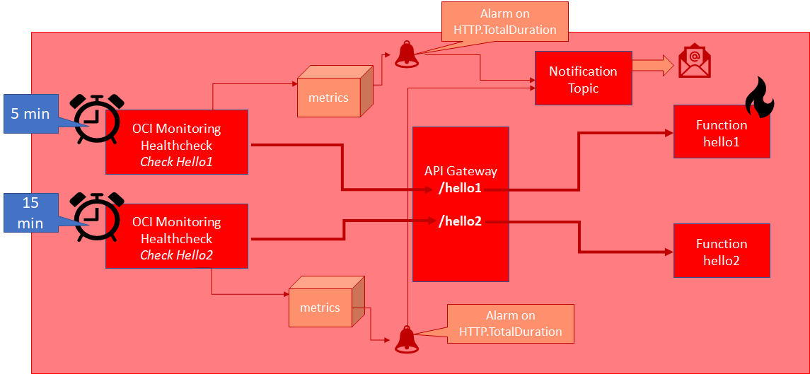

# Summary

This completes this scenario.

You have:
* created and deployed two functions - *hello1* and *hello2*
* created publicly accessible routes for the two functions in the API Gateway
* created health checks for the two routes (and indirectly the two functions)
* create alarms for the two health checks - to publish notifications when the function invocation time is slowish

