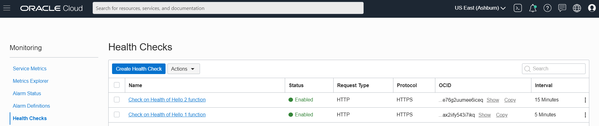

# Create Monitor Healthchecks for the two Routes
Create a Healthcheck for the /hello1 function, with the an interval of 5 minutes: 

/my-depl$LAB_ID

echo "${deploymentEndpoint///my-depl$LAB_ID/}" 

export apiGatewayURL=${deploymentEndpoint///my-depl$LAB_ID/}
export apiGatewayServerX=${apiGatewayURL/https:/} 
apiGatewayServer=$(echo "$apiGatewayServerX" | tr  '//' ' ') 
echo $apiGatewayServer


```
export apiGatewayURL=${deploymentEndpoint///my-depl$LAB_ID/}
export apiGatewayServerX=${apiGatewayURL/https:/} 
apiGatewayServerY=$(echo "$apiGatewayServerX" | tr  '//' ' ') 
apiGatewayServer=$(echo "$apiGatewayServerY" | tr  -d "[:space:]") 

oci health-checks http-monitor create --compartment-id=$compartmentId --display-name="Check on Health of Hello 1 function" --interval-in-seconds=300 --targets="[\"$apiGatewayServer\"]" --method=GET --path="/my-depl$LAB_ID/hello1"  --port=443 --protocol=HTTPS --vantage-point-names="[\"azr-hkg\", \"aws-lhr\"]"
```{{execute}}

Now create the second health check for function *hello2* with an interval of 900 seconds (15 minutes):

```
oci health-checks http-monitor create --compartment-id=$compartmentId --display-name="Check on Health of Hello 2 function" --interval-in-seconds=900 --targets="[\"$apiGatewayServer\"]" --method=GET --path="/my-depl$LAB_ID/hello2"  --port=443 --protocol=HTTPS --vantage-point-names="[\"azr-hkg\", \"aws-lhr\"]"
```{{execute}}

Findings for the health checks take about one minute to become available. They can be inspected in the console and through queries to the monitoring API. This statement returns all health check metrics - grouped by vantage point. 

`oci monitoring metric-data summarize-metrics-data --compartment-id=$compartmentId --namespace="oci_healthchecks" --query-text="HTTP.TotalDuration[1m]{resourceDisplayName = \"Check on Health of Hello 1 function\"}.mean()"`{{execute}}

It is probably easier to inspect the findings from the healthchecks in the console. Note: we expect both healthchecks to report health all the time. However we expect a substantial difference in the total HTTP Processing Time. We expect function *hello1* to stay hot - because every time before it could go cold, it is invoked again by the Health Check. Function *hello2* by contrast goes cold after each healthcheck and therefore every healthcheck takes the hit of reinitializing the cold function. This should result in a significant difference between the metrics for the two healthchecks. 

