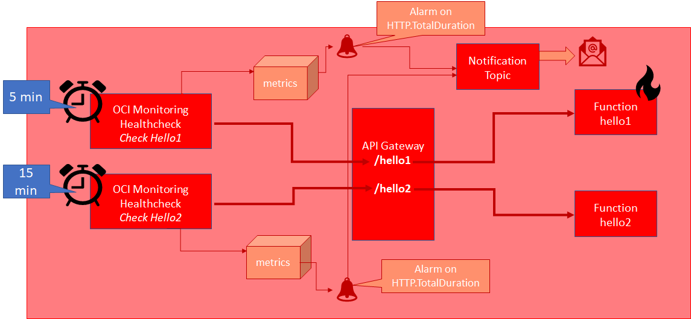
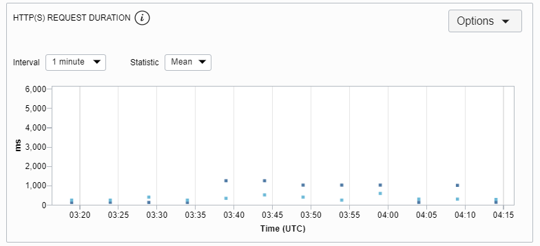

 Create an Alarm for the Healthcheck Metrics

 In this final step, you will create an alarm that reports a notification when the average HTTP Processing time is longer than 2 seconds for the two healthchecks we have created. As stated before, we expect the healthcheck for function *hello2* (the cold function) to trigger the alarm.



 The steps we will go through:
* create notification topic *lab-notification-topic-$LAB_ID*
* create alarms for both healthchecks - associated with notification topic

This next command creates a Notification Topic called *lab-notification-topic-$LAB_ID*.
`oci ons topic create --compartment-id=$compartmentId --name=lab-notification-topic-$LAB_ID --description="notification topic gets notified for lab alarms"`{{execute}}

List all Notification Topics in compartment *lab-compartment* and verify that a new topic has been created:
`oci ons topic list --compartment-id=$compartmentId --output table`{{execute}}

Get hold of Topic OCID
```
export ONS_TOPIC_OCID=$(oci ons topic list --compartment-id=$compartmentId | jq -r --arg name "lab-notification-topic-$LAB_ID" '.data | map(select(."name" == $name)) | .[0] | ."topic-id"')
echo "OCID for the Notification Topic lab-notification-topic-$LAB_ID  = $ONS_TOPIC_OCID"
```{{execute}}

Create the two alarms that trigger when the function execution from the health checks takes longer than 2000 ms:
```
oci monitoring alarm create --compartment-id=$compartmentId --display-name=lab-poor-function-hello1-response-$LAB_ID --destinations="[\"$ONS_TOPIC_OCID\"]"  --display-name="Function hello1 response takes a long time" --metric-compartment-id=$compartmentId --namespace="oci_healthchecks"  --query-text="HTTP.TotalDuration[1m]{resourceDisplayName = \"Check on Health of Hello 1 function\"}.mean() > 2000"  --severity="INFO" --body="The execution of function hello1 took quite long" --pending-duration="PT5M"  --resolution="1m" --is-enabled=true

oci monitoring alarm create --compartment-id=$compartmentId --display-name=lab-poor-function-hello2-response-$LAB_ID --destinations="[\"$ONS_TOPIC_OCID\"]"  --display-name="Function hello2 response takes a long time" --metric-compartment-id=$compartmentId --namespace="oci_healthchecks"   --query-text="HTTP.TotalDuration[1m]{resourceDisplayName = \"Check on Health of Hello 2 function\"}.mean() > 2000"   --severity="INFO" --body="The execution of function hello2 took quite long" --pending-duration="PT5M"  --resolution="1m" --is-enabled=true
```{{execute}}

Now you have to sit back and relax - and see whether any alarm will start firing.

You can check the alarms status most easily in the console:
Check out the alarm definition - and its current state - in the console :
`echo "Open the Console at URL https://console.$REGION.oraclecloud.com/monitoring/alarms"`{{execute}}

or through the CLI

`oci monitoring alarm list --compartment-id=$compartmentId --output table`{{execute}}

## Findings

Your findings can be different from mine. Mine were not as clear as I had expected them to be. The chart for total http duration for function 1 - with two vantage points, over a period of 6 hours - looked as follows:

The closer vantage point reporting between 100 and and 300ms most of times.

The similar chart for function2 - with calls only every 15 minutes, a period long enough for the function to go cold (or so I believed) in the absence of other calls - came out as follows:

With a few reports around 2000 ms - presumably when the function had to be reinitialized - most reports indicate a value of 140 ms, on par with the best findings for function1. It would seem that function2 does not nearly grow cold as often as I had anticipated.

I would like to repeat the experiment with a longer interval than 15 minutes - but unfortunately that is the longest interval we can set for health checks.