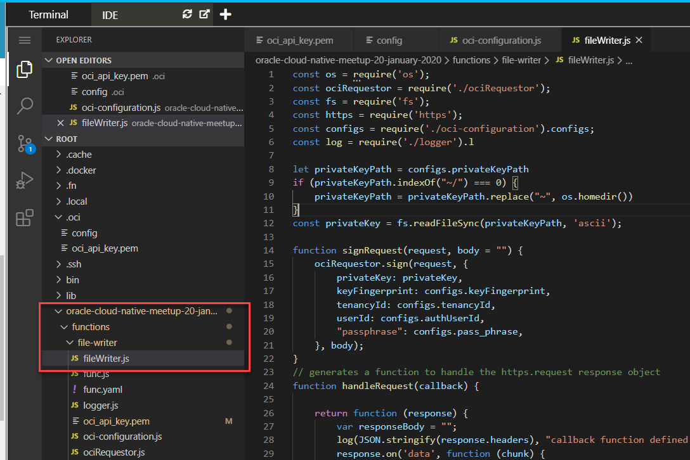

# Creating a Node JS Application to Write Files on OCI Object Storage

OCI can be accessed through a console, through the OCI CLI and through REST APIs. Custom applications probably work most easily with this last option. In this step you will create (well, actually the code is already there, cloned from github and almost ready to execute) and test a Node JS application that writes files on OCI Object Storage. 

First, you need a to create a Bucket on OCI Object Storage. This *bucket* is similar to a folder or directory on a regular file system: a container to group files in. The Bucket is called oci-lab# - where # is the number you have been assigned for this workshop.

`oci os bucket create -c $compartmentId --name "oci-lab$LAB_ID"`{{execute}} 

The bucket is now created. Let's assign the bucket's OCID to an environment variable:

```
export bucketName="oci-lab$LAB_ID"
bucket=$(oci os bucket get --bucket-name $bucketName)
bucketOCID=$(echo $bucket | jq -r  '.data | .id')
echo "Bucket OCID for bucket $bucketName is $bucketOCID "
```{{execute}}

You may want to inspect the code of the FileWriter application. Open the IDE tab and locate file ~/oracle-cloud-native-meetup-20-january-2020/functions/file-writer/fileWriter.js.


The function itself is quite simple - apart from the code required to make authorized requests to the OCI REST APIs. Function *fileWriter* calls *createFileObject* to invoke the OCI Object Storage Service API to create the file in the indicated bucket. Function *fileWriter* itself is called from function *run* with input parameters based on the command line arguments passed when running the node application as you will do in a little while.

Most complexity is around the signing of the REST request using the private key. Function *signRequest* is the linking pin to this signing operation.


## Prepare Node application
Some steps are required before the Node application can be successfully executed.

### Configure OCI connection details

Copy the private key file used for accessing OCI to the Function resources directory:
`cp ~/.oci/oci_api_key.pem ~/oracle-cloud-native-meetup-20-january-2020/functions/file-writer/oci_api_key.pem`{{execute}}

Open file `~/oracle-cloud-native-meetup-20-january-2020/functions/file-writer/oci-configuration.js` in the IDE. This file is used by the Node application to connect to the OCI REST APIs. It has to make signed HTTP requests - signed using the private key of an OCI User with necessary permissions on the OCI Object Storage.

Copy the JSON snippet produced by the next command between the curly braces in fil *oci-configuration.js*:
```
json="\"namespaceName\": \"$ns\",\n
\"region\": \"$REGION\",\n
\"compartmentId\": \"$compartmentId\",\n 
\"authUserId\": \"$USER_OCID\",\n
\"identityDomain\": \"identity.$REGION.oraclecloud.com\",\n
\"tenancyId\": \"$TENANCY_OCID\",\n
\"keyFingerprint\": \"YOUR_FINGERPRINT_FROM FILE ./oci_api_key.pem\",\n
\"privateKeyPath\": \"./oci_api_key.pem\",\n
\"coreServicesDomain\": \"iaas.$REGION.oraclecloud.com\",\n
\"bucketOCID\": \"$bucketOCID\",\n
\"bucketName\":\"$bucketName\",\n
\"objectStorageAPIEndpoint\":\"objectstorage.$REGION.oraclecloud.com\",\n
\"streamingAPIEndpoint\": \"streaming.$REGION.oci.oraclecloud.com\"\n
"
echo "paste JSON fragment in file oci-configuration.js "
echo -e $json
```{{execute}}

Define the correct value for the *keyFingerprint* property in this file: replace the text *YOUR_FINGERPRINT_FROM FILE ./oci_api_key.pem* with the actual fingerprint value from the indicated file. 

### Install required libraries

Navigate to the directory that contains the File Writer application:

`cd ~/oracle-cloud-native-meetup-20-january-2020/functions/file-writer`{{execute}}

and run `npm install` to install the required libraries.

`npm install`{{execute}} 

## Run the File Writer to create a new file on OCI Object Storage

Run the File Write application with the following command:

`node fileWriter '{"bucket":"oci-lab$LAB_ID","fileName":"secret.txt", "contents":{"File Contents":"Contents, Contents and more Contents"}}'`{{execute}}

Check the current contents of the bucket:

`oci os object list --bucket-name $bucketName`{{execute}}

Check in OCI Console for Object Storage: the bucket you have created and the file that should now be visible and manipulatable in the console: https://console.us-ashburn-1.oraclecloud.com/object-storage/buckets.
`echo "Open the console at https://console.${REGION,,}.oraclecloud.com/object-storage/buckets"`{{execute}}

Retrieve the file that was just created:

`oci os object get  -bn $bucketName --name secret.txt --file secret-from-oci.txt`{{execute}}

Check contents of the file:
```
ls -l secret*
cat secret-from-oci.txt
```{{execute}}

At this point, we are capable of creating file objects on OCI Object Storage from a Node application. We can wrap this application in a Function that we can also deploy on OCI. That will be (y)our next step.

## Resources

A blog article: [Publish Oracle Function for Reading and Writing Object Storage Files through OCI API Gateway](https://technology.amis.nl/2020/01/05/publish-oracle-function-for-reading-and-writing-object-storage-files-through-oci-api-gateway/)
