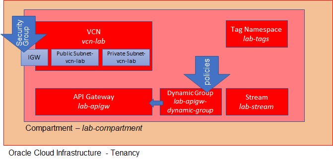

This scenario will guide you in preparing your OCI Tenancy for the REAL OCI Katacoda handson labs. The assumption is that you are the administrator of the tenancy - either a fresh or preexisting cloud trial or a "regular" OCI tenancy.

Note: step 1 provides some hints for getting a free trial on Oracle Cloud Infrastructure in case you do not yet have a tenancy. If you do have access to an OCI instance, then you skip step 1 and go to step 2. 

The fully prepared handson environment will live in a single compartment called *lab-compartment*. This compartment contains:
* an API Gateway
* a Stream
* a Dynamic Group 
* a VCN with subnets and an Internet Gateway
* a Tag Namespace

During the labs, you will create additional OCI resources, neatly organized in the *lab-compartment*.

It is assumed that you do the handson scenarios as an administrator for the tenancy. This means that you do not need to create a user, groups nor policies.  

