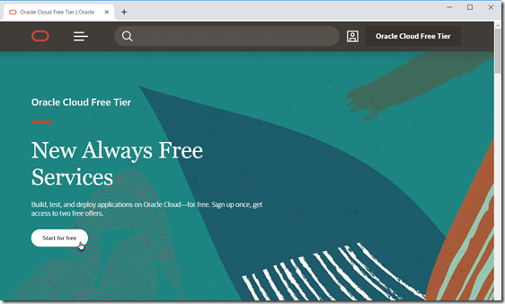
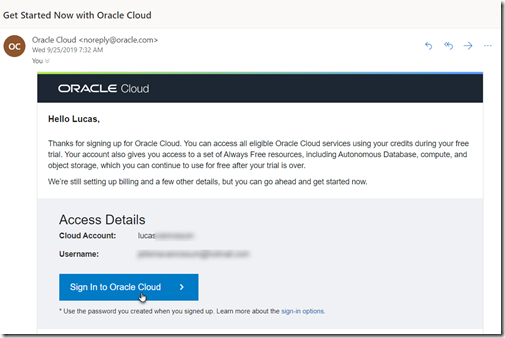

# Prepare an OCI Tenancy

The Katacoda workshop scenarios on OCI require an OCI environment to be prepared. This environment is set up in an OCI Tenancy. This can be an existing, paid for OCI Tenancy, or a Tenancy created as a Free Trial.

If you have an OCI tenancy at your disposal, please go the next step in this scenario. However, if you do not currently have access to an OCI Tenancy, you can have an environment provisioned for you as part of a 30-day free trial. 

You will need the following:

* an email address
* a mobile phone to receive a confirmation code per SMS
* a credit card (the trial really is free, but you need to record payment details all the same)

Then goto https://www.oracle.com/cloud/free/ and click on *Start for free* to sign up for a free trial.

You will define a cloudaccount (name of the tenancy), your username and a password. You also need to select a Region; this could be one close to you (for lowest network latency) or one that has the services available you want to look at. For the workshop scenarios on Katacoda, the safest bet is to go with region Ashburn (US East). All scenarios have been tested on that region, some of code snippets have to be adjusted for any other region, this region is eligible for the always free tier and this region seems to be first in the roll out of new OCI services.

Once you have acquired the cloud trial and the tenancy has been provisioned, you will receive an email, inviting you to sign in to your account, change your temporary password and then you can continue with the next steps in this scenario. 
