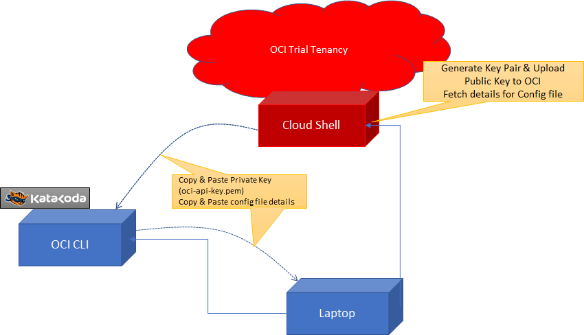
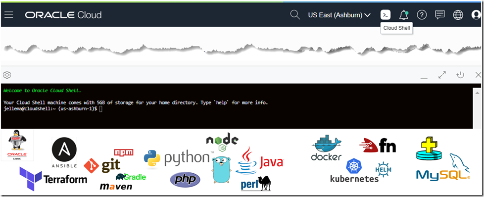
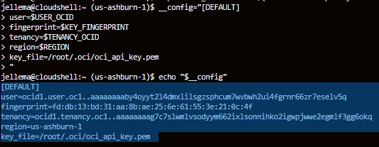
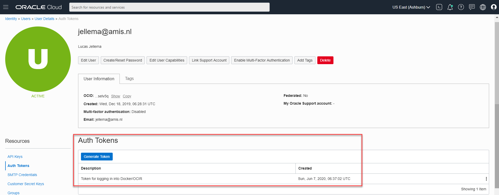

# Prepare OCI Tenancy for the REAL OCI Katacoda Scenarios

This and the next preparatory steps can (only) be performed by the user who is the tenancy owner or by another user who is member of Administrators Group. In this step, you will create a config file and a public/private key pair - required by the OCI CLI tool that you will be using in the other scenarios. You will use the Cloud Shell tool to get easy command line access to a number of tenancy specific values that are need for the config and private key files.



## Retrieve Configuration Values and Private Key
In the scenarios you will be using the OCI CLI (command line interface) on many occasions. You will use fairly simple, straightforward terminal commands with this CLI. This tool in turn interacts with the OCI REST APIs for querying and manipulating OCI resources. OCI CLI needs to be enabled to connect to your tenancy: it needs to know where your OCI tenancy is and how to connect to it. For this, two files need to be prepared:
* ~/.oci/config 
* ~/.oci/oci-api-key.pem

Empty versions of these two files are created as part of every scenario in this series. Look in the file explorer in directory /root/.oci for these two files. Click on *config* to open the empty file.

Here is an example of what the *config* file will look like:

<pre class="file">
[DEFAULT]
user=OCID FOR YOUR TENANCY OWNER USER OR OTHER ADMIN USER
fingerprint=FINGERPRINT FOR KEY FOR USER
tenancy=OCID FOR YOUR TENANCY
region=HOME REGION OF YOUR TENANCY
key_file=/root/.oci/oci_api_key.pem
</pre>

This step in the scenario will help you prepare these files and to add the public key half of the key pair you will generate to the OCI user. The private key half is used to make the OCI CLI work with OCI as the user. 

### Gather Configuration Values in Cloud Shell

Login to the OCI Cloud Console as the tenancy owner (or a user who is administrator). 

Open the OCI Cloud Shell tool, from the OCI Cloud Console.


Note: For clipboard operations, Windows users can use Ctrl-C or Ctrl-Insert to copy, and Shift-Insert to paste. For Mac OS users, use Cmd-C to copy and Cmd-V to paste.

Execute these commands in Cloud Shell to retrieve the OCID (Oracle Cloud Identifier) of the tenancy and the OCID of your user into environment variables, as well as the Region (name and key):
<pre class="file" data-target="clipboard">
export USER_OCID=$(oci iam user list --all | jq -r '.data |sort_by(."time-created")| .[0]."id"')
# Generate private key
mkdir ~/oci-keys
openssl genrsa -out ~/oci-keys/oci_api_key.pem 2048
# generate public key
openssl rsa -pubout -in ~/oci-keys/oci_api_key.pem -out ~/oci-keys/oci_api_key_public.pem
# upload public key
oci iam user api-key upload --user-id $USER_OCID --key-file ~/oci-keys/oci_api_key_public.pem

# Get important login values
export KEY_FINGERPRINT=$(oci iam user api-key list --user-id $USER_OCID | jq -r '.data |sort_by(."time-created")| .[-1]."fingerprint"')
export TENANCY_OCID=$(oci iam user list --all | jq -r '.data[0]."compartment-id"')
export REGION=$(oci iam region-subscription list | jq -r '.data[0]."region-name"')
export REGION_KEY=$(oci iam region-subscription list | jq -r '.data[0]."region-key"')
reset && echo -e "# Copy and paste the following into the Katacoda terminal:\n# Echo the login details into the correct file path in Katacoda
echo \"[DEFAULT]\nuser=$USER_OCID\nfingerprint=$KEY_FINGERPRINT\ntenancy=$TENANCY_OCID\nregion=$REGION\nkey_file=/root/.oci/oci_api_key.pem\" >  ~/.oci/config\n
# Echo the private key into the correct file path in Katacoda. Keep this secret!\n
echo \"$(cat ~/oci-keys/oci_api_key.pem)\" > /root/.oci/oci_api_key.pem\n# copy from the top of this terminal to the line above"
</pre>

Select the output from this command in Cloud Shell and copy it to the clipboard (through right mouse menu or using Ctrl-C or Ctrl-Insert in Windows and Cmd-C on Mac OS).


## Try out the OCI CLI connection to your Tenancy
To make sure that the *config* file and the *oci-api-key.pem* file have the correct contents, try out the following command to get a list of all namespaces you currently have access to - based on the OCI Configuration defined above.

`oci os ns get`{{execute}} 

If this command gives a proper response, the configuration is most likely correct.

Another test - listing all users in your OCI tenancy:

`oci iam user list --all`{{execute}}

Set environment variables in the Katacoda environment with the Tenancy OCID, the region name and the region key:

```
export TENANCY_OCID=$(oci iam user list --all | jq -r  '.data[0]."compartment-id"')
export REGION=$(oci iam region-subscription list | jq -r '.data[0]."region-name"')
export REGION_KEY=$(oci iam region-subscription list | jq -r '.data[0]."region-key"')
```{{execute}}

Note: the following syntax will be used to use the lowercase value for region:
`echo ${REGION,,}`{{execute}}

## Auth Token for OCIR (Container Registry)

For working with Functions, you need an auth token for working with the OCI Container Registry. The next script generates such a token for the tenancy owner (the oldest user in the tenancy). Please record this token for use in the scenarios that work with functions. Note: you can find these tokens in the console as well: https://console.us-ashburn-1.oraclecloud.com/identity/users/<user-ocid>/swift-credentials. 


Execute this command to generate the Auth Token

```
USER_OCID=$(oci iam user list --all | jq -r  '.data |sort_by(."time-created")| .[0]."id"')
authTokenJS=$(oci iam auth-token create --description "Token for logging in into Docker/OCIR" --user-id $USER_OCID)
echo $authTokenJS
authToken=$(echo $authTokenJS | jq --raw-output .data.token)
echo "Token for logging in into Container Registry $authToken"
NAMESPACE=$(oci os ns get| jq -r  '.data')
USER_USERNAME=$(oci iam user list --all | jq -r  '.data |sort_by(."time-created")| .[0]."name"')
echo "Username for logging in into Container Registry is $NAMESPACE/$USER_USERNAME"
```{{execute}}

Note: Record the Auth Token and the Username for logging in into the Container Registry for future use.


## Create Local Copies of Files config and oci-api-key.pem
You will need *config* and *oci-api-key.pem* files in almost every REAL Katacoda OCI scenario. You will be copying and pasting the contents of these files in each scenario. Therefore, now is a good time to prepare copies of these files, locally on your laptop. Note that the Katacoda environment is ephemeral: in less than 50 minutes, it will vanish.

Open file *~/.oci/config* in the text editor, copy the contents and paste it to a local file on your laptop's file system. Make sure you will be able to find this file for the subsequent Katacoda scenarios.

In the same vein, Open file *~/.oci/oci-api-key.pem* in the text editor, copy the contents and paste it to a local file on your laptop's file system. Make sure you will be able to find this file too for the subsequent Katacoda scenarios. Note: do not share this file with anyone: it contains the private key to your tenancy.

