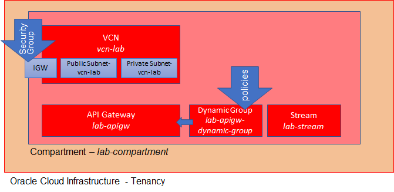
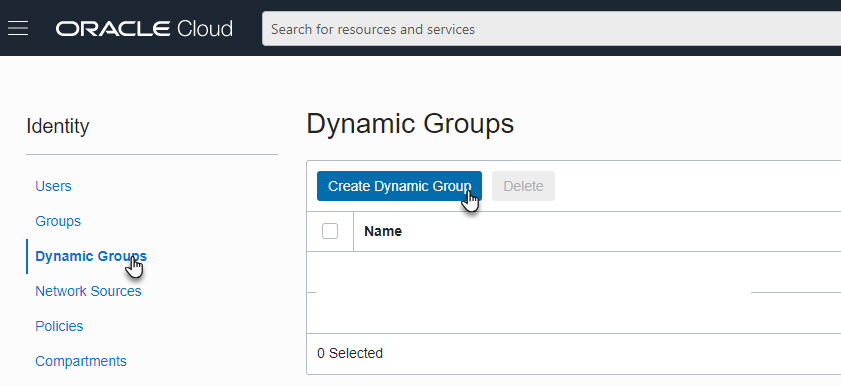
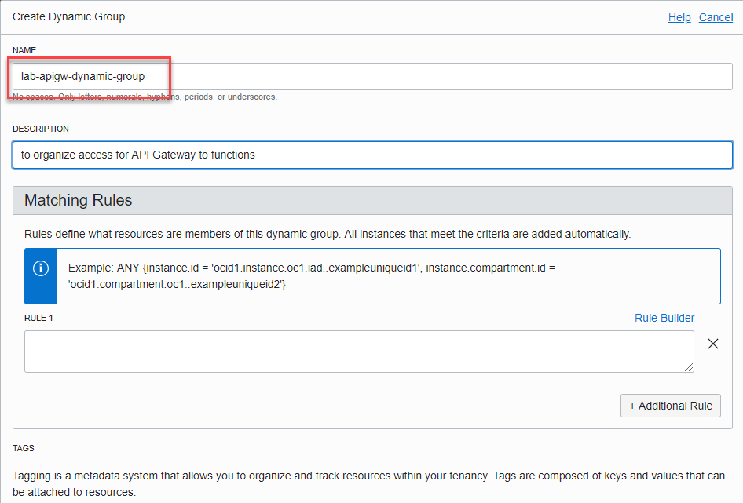

# Create OCI Resources

The Lab environment uses a compartment called *lab-compartment* to hold all new OCI resources. When you are done with this scenario, the tenancy will have this compartment, set up like this:



The resources are created in the OCI tenancy - in the *lab-compartment* from the OCI CLI environment set up in the Katacoda scenario VM:


Create this compartment with the following commands:

```
compartment=$(oci iam compartment create --compartment-id "$TENANCY_OCID"  --name "lab-compartment" --description "Compartment for resources for REAL Cloud Native workshop")
echo "JSON response from the command to create the compartment:"
echo $compartment
compartmentId=$(echo $compartment | jq --raw-output .data.id)
echo The OCID for the lab compartment:  $compartmentId
```{{execute}}

To set an environment variable $compartmentId fetch the OCID from the compartment with this command (this also works when the compartment already existed prior to running this scenario):
```
cs=$(oci iam compartment list)
export compartmentId=$(echo $cs | jq -r --arg display_name "lab-compartment" '.data | map(select(."name" == $display_name)) | .[0] | .id')
```{{execute}}

Create tags namespace lab-tags in compartment lab-compartment
TODO


## Create Virtual Cloud Network (aka VCN)

The Virtual Cloud Network defines the connections within and two resources in the *lab-compartment*. It consists of quite a few moving parts. Fortunately, the OCI Console provides a wizard that creates all these parts for us. Run the OCI Networking Quickstart wizard in the context of compartment *lab-compartment*  – to create VCN, subnets, internet gateway, NAT gateway, service gateway.

Note: this wizard is available in the OCI Console: https://console.us-ashburn-1.oraclecloud.com/networking/vcns ; replace the section *us-ashburn-1* with your tenancy's home region.

`echo "Open the console at https://console.${REGION,,}.oraclecloud.com/networking/vcns"`{execute}


Select the default option in th VCN wizard "VCN with Internet Connectivity" and press *Start VCN Wizard*.


Use as the name of the VCN: *vcn-lab*. Accept all examples for CIDR blocks and default settings elsewhere. 


When the wizard is done run this statement to retrieve the OCID of the VCN that has been created, as well as the public subnet's id and the identifier of the security list created for the VCN:
```
vcns=$(oci network vcn list  --compartment-id $compartmentId --all)
export vcnId=$(echo $vcns | jq -r --arg display_name "vcn-lab" '.data | map(select(."display-name" == $display_name)) | .[0] | .id')
echo "$vcnId"
subnets=$(oci network subnet list  -c $compartmentId --vcn-id $vcnId)
export subnetId=$(echo $subnets | jq -r --arg display_name "Public Subnet-vcn-lab" '.data | map(select(."display-name" == $display_name)) | .[0] | .id')

sls=$(oci network security-list list  -c $compartmentId --vcn-id $vcnId)
export slOCID=$(echo $sls | jq -r '.data | .[0] | .id')

```{{execute}}

## Define Network Security Rule to allow Inbound Traffic to Port 443 

Note: this step is required for the use of the API Gateway. 

Add a network security rule to allow inbound traffic to public subnet on port 443. 

Open the OCI Console for the security list:
`echo "Open the console at https://console.${REGION,,}.oraclecloud.com/networking/vcns/$vcnId/security-lists/$slOCID"
`{{execute}}


Press *Add Ingress Rule*. 

Specify source CIDR as 0.0.0.0/0 (anything goes) and set *Source Port Range* to *All*. Set *Destination Port Range* to *443*. Leave the IP protocol at the default of *TCP*. Press *Add Ingress Rule*.


## Create API Gateway

Create an API Gateway called *lab-apigw* using the following command. Note how this gateway references the public subnet identifier of the VCN.

`oci api-gateway gateway create --compartment-id $compartmentId --endpoint-type PUBLIC  --display-name lab-apigw --subnet-id $subnetId `{{execute}}

Retrieve the API Gateway's OCID
```
apigws=$(oci api-gateway gateway list -c $compartmentId)
export apiGatewayId=$(echo $apigws | jq -r --arg display_name "lab-apigw" '.data.items | map(select(."display-name" == $display_name)) | .[0] | .id')
```{{execute}}

Create a Dynamic Group through Console to allow API Gateway access to functions - called *lab-apigw-dynamic-group*

`echo "Open the console at https://console.${REGION,,}.oraclecloud.com/identity/dynamicgroups"
`{{execute}}
Open the editor to create the Dynamic Group:

and set the name to *lab-apigw-dynamic-group*. Then press the button *Create Dynamic Group* in the lower left hand corner.



Create the Dynamic Group through the OCI CLI:

`oci iam dynamic-group create --name "lab-apigw-dynamic-group"  --description "to organize access for API Gateway to functions" --compartment-id $TENANCY_OCID`{{execute}}

Create a rule for dynamic group from the OCI CLI command line:

`oci iam dynamic-group create --compartment-id $TENANCY_OCID --name "lab-apigw-dynamic-group" --description "to collect API Gateways in Compart lab-compartment"  --matching-rule "[ \"ALL {resource.type = 'ApiGateway', resource.compartment.id = '$compartmentId'}\"]" `{{execute}}

## Create Stream

Create a stream called *lab-stream* :

`oci streaming admin stream create --name "lab-stream" -c $compartmentId --partitions 1`{{execute}}

