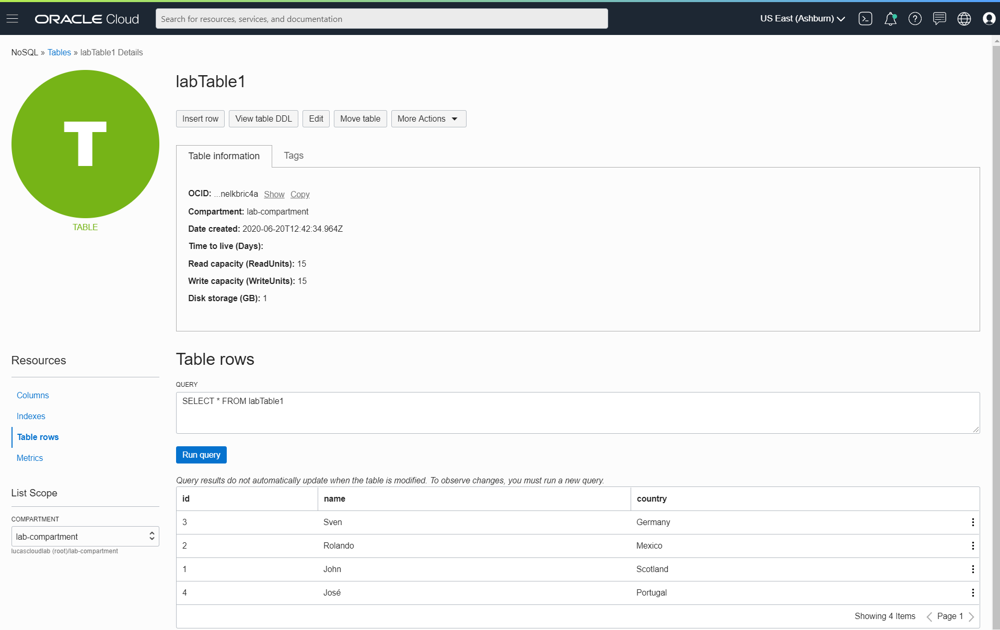

Querying data from the table

`oci nosql query execute --compartment-id $compartmentId --statement="SELECT * FROM $tableName"`{{execute}}

Of course there is no data yet. Let us create a record:

`oci nosql query execute --compartment-id $compartmentId --statement="INSERT INTO $tableName (id, name, country) VALUES (1,\"John\",\"Scotland\")"`{{execute}}

If the INSERT keyword is used, the row will be inserted only if it does not exist already. If the UPSERT keyword is used, the row will be inserted if it does not exist already, otherwise the new row will replace the existing one. 

And query the table again for all its data:
`oci nosql query execute --compartment-id $compartmentId --statement="SELECT * FROM $tableName"`{{execute}}

And some more records:
```
oci nosql query execute --compartment-id $compartmentId --statement="INSERT INTO $tableName  (id, name, country)  VALUES (2,\"Rolando\",\"Mexico\")"
oci nosql query execute --compartment-id $compartmentId --statement="INSERT INTO $tableName  (id, name, country) VALUES (3,\"Sven\",\"Germany\")"
oci nosql query execute --compartment-id $compartmentId --statement="INSERT INTO $tableName  (id, name, country) VALUES (4,\"José\",\"Portugal\")"
```{{execute}}

Check in the console for the NoSQL Table's contents:

```
echo Open the following URL in the OCI Console to find the current data records in the newly created table: https://console.$REGION.oraclecloud.com/nosql/tables/$tableName/$compartmentId/rows
```{{execute}}



And query the table again for all its data:
`oci nosql query execute --compartment-id $compartmentId --statement="SELECT * FROM $tableName"`{{execute}}

You will notice that only the first "page" of data is returned. The size of the page depends on the limit on read units that we defined for the page. To get more results, we can increase the number of supported read units. Alternatively, we can retrieve data in multiple pages. Execute the next command to derive the page token representing the page at which to start retrieving results :
```
query=$(oci nosql query execute --compartment-id $compartmentId --statement="SELECT * FROM $tableName")
page=$(echo $query | jq -r '."opc-next-page"')
echo The page token we need to provide to the query command to fetch the next page of data: $page
```{{execute}}

And now execute the query that will return this next page of results:
`oci nosql query execute --compartment-id $compartmentId --statement="SELECT * FROM $tableName" --page $page`{{execute}}

