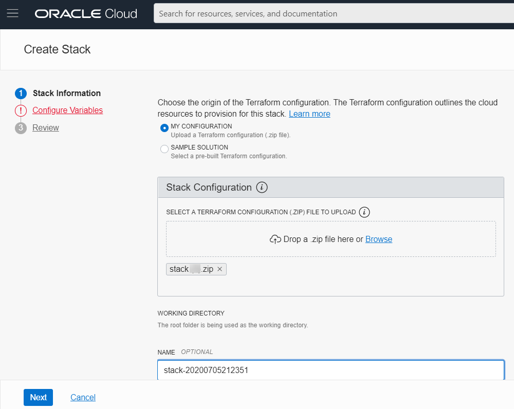
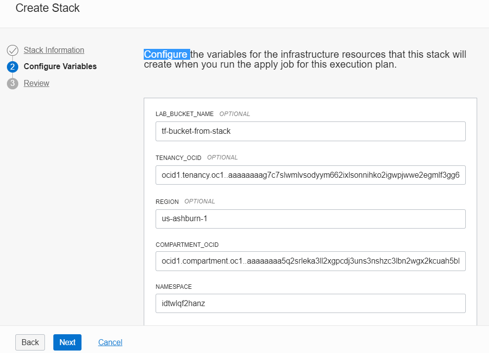
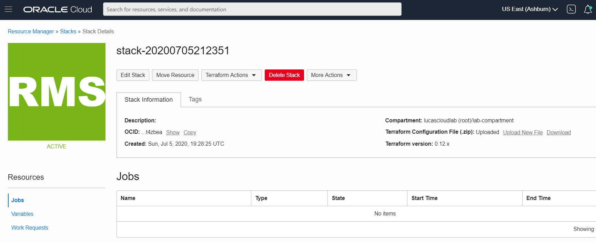
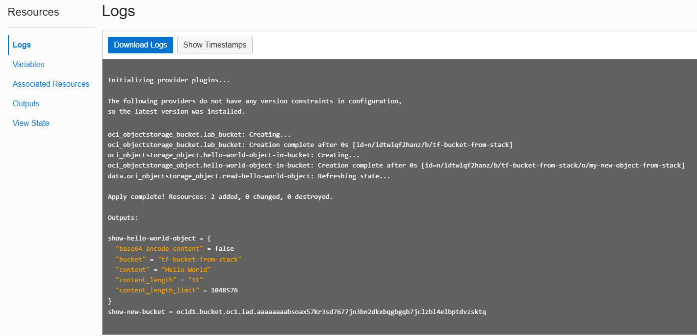
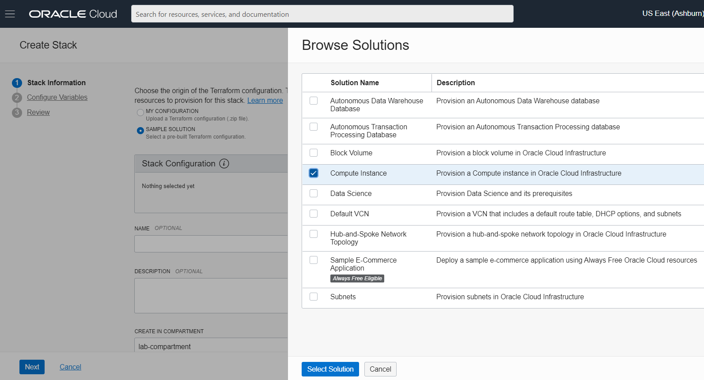
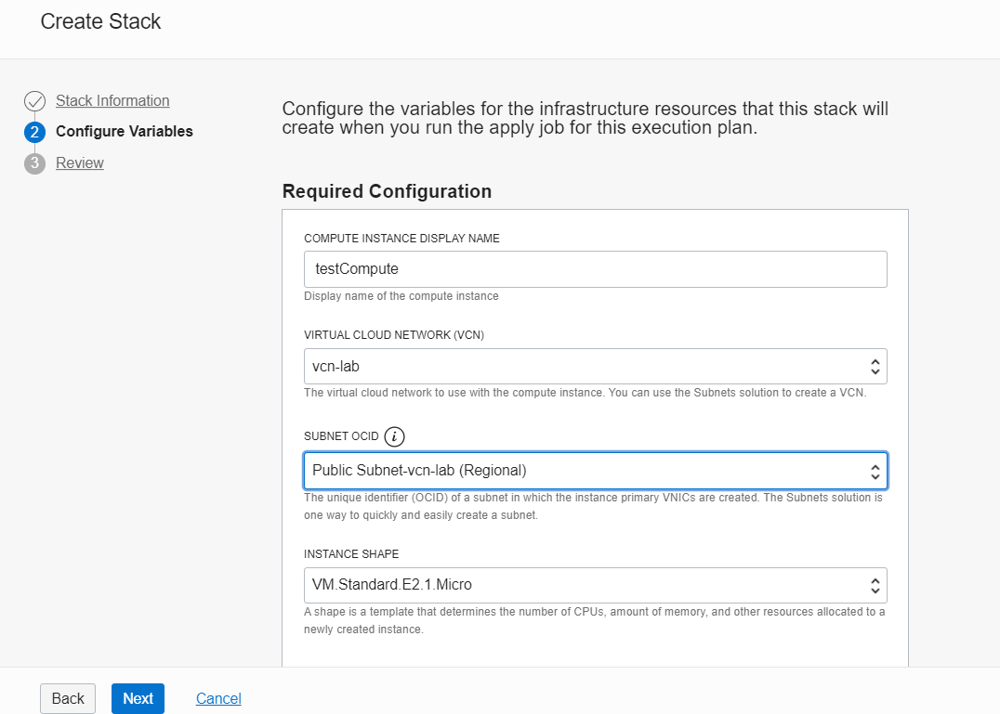
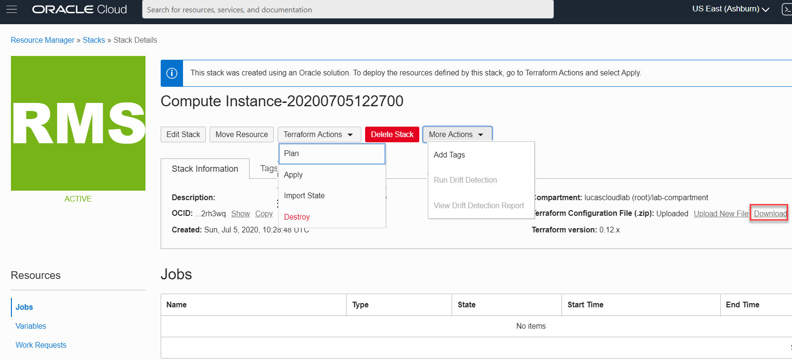
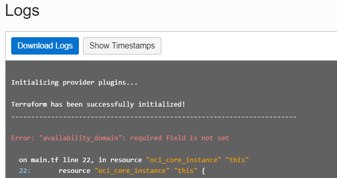
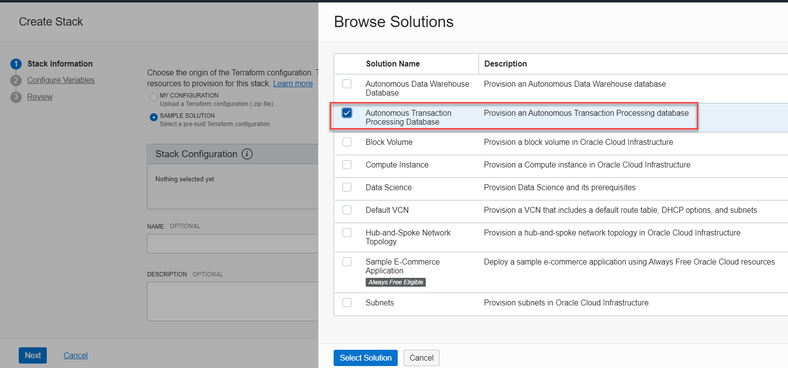

Resource Management and Stacks

The OCI CLI command for creating a stack from the file *stack.zip* that simply contains the *main.tf* and *variables.tf* that we have been working with in this scenario. Unfortunately: this command is not currently processed correctly by the CLI, and we do not seem to be able to create a stack from the command line.  
`oci resource-manager stack create -c="$compartmentId" --config-source="./stack.zip" --display-name "Bucket and Object Stack"  --description="A sample stack consisting of a Bucket and an Object in the Bucket" --terraform-version="0.12.x"  --variables="{\"namespace\":\"$ns\",\"compartment_id\":\"$compartmentId\"}"`{{execute}}

Let's go to the OCI Console, to the page where stacks can be added - as well as managed:
`echo "To inspect, create and edit Stacks open your browser at url https://console.$REGION.oraclecloud.com/resourcemanager/stacks"`{{execute}}

## Custom Solution
Click on *Create Stack*. Leave the radio button on *Custom Solution*.

Upload stack.zip file. This file is in the directory */root/stack* of the scenario. You can download it to your laptop from this URL on GitHub: https://github.com/RedExpertAlliance/katacoda-scenarios/blob/master/oci-course/oci-terraform-provider/assets/stack/stack.zip  (in REAL OCI Katacoda Scenarios GitHub repo: https://github.com/RedExpertAlliance/katacoda-scenarios/tree/master/oci-course ).

Press Nex to go to step 2 - *Configure Variables*

### Set variables
The variables required for this stack are almost all defined through acceptable defaults or inherited from the envionment settings of the Stack Manager (such as compartment and tenancy). You only need to provide the value for the *namespace* variable.

Use this value:
`echo "Value for variable namespace $ns"`{{execute}}

Press Next to go to the Review of the Variable values. The press Create to complete the creation process for the stack.

The stack is now part of the tenancy and the compartment. It is available for further editing and of course to *plan* and *apply*.
 

You can also list the stacks in the OCI CLI:
`oci resource-manager stack list --compartment-id=$compartmentId`{{execute}}

### Plan
Open the dropdown *Terraform Actions* and select the action *Plan*.

The Resource Manager will now inspect the stack to discover if it can be realized and what it would entail if it is. The outcome of this action is a log that shows what the Configuration would result in.

### Apply
The same dropdown *Terraform Actions* also includes action *Apply*. Select this action. Now Resource Manager will execute the plan; this means that a bucket - with a name specified in a variable (default is *tf-bucket-from-stack*)  and an object in that bucket will be created. 

You can inspect the values of variables as assigned during the apply, the created resources and the outputs as well as the final state - through the four menu items shown on the left side of the page.

### Change Variable: Bucket Name
We are going the same stack a second time, with a different value for the bucket. Navigate to the *stack details* for the stack. Click on *Edit Stack*. Go to step 2 in the wizard: *Configure Variables* . Change the value for variable *LAB_BUCKET_NAME* into something different - for example *2nd-tf-bucket-from-stack*. Click *Next* and click *Save Changes* . 

### Apply Again
From the dropdown with *Terraform Actions* , select once again the option to *Apply*. The same stack is processed - with a tiny change: the name of the target bucket is different. The process should be successful and report back that it has created a bucket and an object. You can check, either in the Console or in the terminal:
`oci os bucket list -c $compartmentId`{{execute}}

if the two buckets have both been created successfully.

The message to take away: the stack is like a template that can be used many times - with different input and/or in a different (target) compartment - to create and manage OCI Resources.

### Destroy the Results of the Stack

From the dropdown with *Terraform Actions* , select the option to *Destroy*. A new job is started to delete all the OCI Resources described in the current definition of the stack and its input variables. The log files produced by the job indicate what was done: two objects destroyed (one bucket and the object in that bucket).

In order to undo the results from the first run of the stack, you should now change back the name of the *LAB_BUCKET_NAME* to its original value and then run *Destroy* once more. 

Navigate to the *stack details* for the stack. Click on *Edit Stack*. Go to step 2 in the wizard: *Configure Variables* . Change the value for variable *LAB_BUCKET_NAME* to its original value. From the dropdown with *Terraform Actions* , select the option to *Destroy*. A new job is started to delete all the OCI Resources described in the original definition of the stack and its input variables. The log files produced by the job indicate what was done: the two objects created when you first ran the stack are now also destroyed (one bucket and the object in that bucket). And we are back in the state we were in before we started dabbling in Stacks.

### Destroy Variables (back)

### Destroy Again

And now all traces of the stack are removed - except the stack itself that is still there and ready to be re-applied - once or many times! 

## Sample Solutions
Oracle provides a collection of *Sample Solutions* - prebuilt Terraform configurations that we can use to quickly create a specific solution consisting of a number of OCI Resources. Just as interestingly, we can use these samples as inspiration - tinkering with them to fit our specific purpose or copying and pasting parts of these solutions into our own configuration.

Click on *Create Stack*. Select the radio button *Sample Solution*. Then click on *Select Solution*. From the list of sample solutions, select *Compute Instance*.

Click on Next. Select *vcn-lab* as the Virtual Cloud Network. Select the Public Subnet as the Subnet.

Click Next. And click Create.

Note: at the time of creating a *stack* - the only thing we are doing is making a Terraform configuration available as an OCI resource. The configuration is not yet planned or applied; no additional OCI Resources are created when we create the stack. Once the stack is there, we can refine the settings of variables and then decide to run a *plan* and eventually an *apply* job.

The new stack is shown. Now we have several options, such as Plan and even Apply the Stack. We can also download the configuration - and see how this sample stack was put together and even start making our own customizations on top of that sample.

Start the *Plan* action for this sample stack. At th time of writing, this action returns an error *Error: "availability_domain": required field is not set*

In order to fix this, it seems that we need to download this configuration, make manual changes to it and upload it again. I will leave this as an exercise for the reader (that is you!)

You could give another sample a spin: for example the sample for the Autonomous Transaction Processing Database.

## Resources

[Create a stack from the command line](https://docs.cloud.oracle.com/en-us/iaas/Content/ResourceManager/Concepts/samplecomputeinstance.htm#build)
