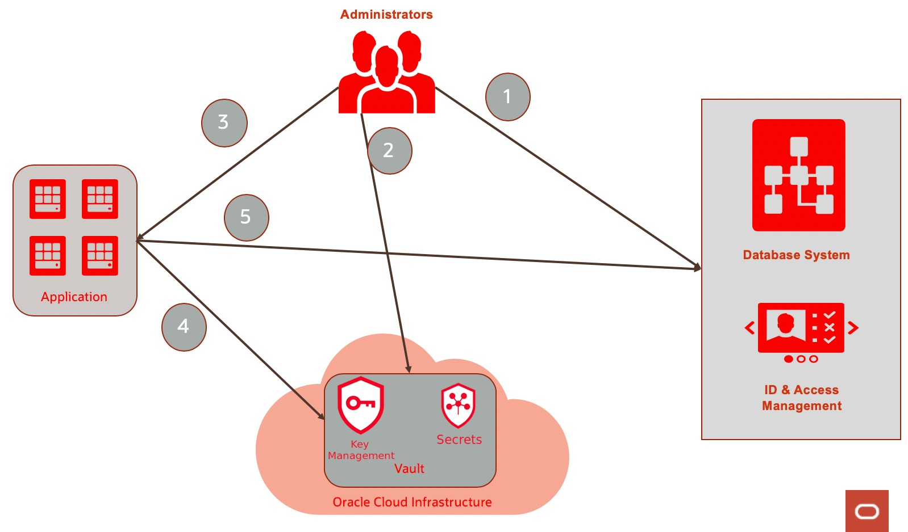

The Vault service lets you create vaults in your tenancy as containers for encryption keys and secrets. Vaults are logical entities where the Vault service creates and durably stores keys and secrets. The type of vault you have determines features and functionality such as degrees of storage isolation, access to management and encryption, and scalability. The type of vault you have also affects pricing.

If needed, a *virtual private vault* provides you with a dedicated partition in a hardware security module (HSM), offering a level of storage isolation for encryption keys that’s effectively equivalent to a virtual independent HSM. Keys are stored on highly available and durable hardware security modules (HSM) that meet Federal Information Processing Standards (FIPS) 140-2 Security Level 3 security certification. The Vault service uses the Advanced Encryption Standard (AES) as its encryption algorithm and its keys are AES symmetric keys.

Note that the virtual private vault has a substantial price tag (several $ per hour) compared to many other services. I have not been able to find out whether the default vault type carries any costs or is part of OCI core fatures.

Before the introduction of secrets as a resource, Oracle Cloud Infrastructure Vault was known as Oracle Cloud Infrastructure Key Management.

## Keys
Keys are logical entities that represent one or more key versions that contain the cryptographic material used to encrypt and decrypt data, protecting the data where it is stored. When processed as part of an encryption algorithm, a key specifies how to transform plaintext into ciphertext during encryption and how to transform ciphertext into plaintext during decryption. 

After you create your first master encryption key, you can then use the API to generate data encryption keys that the Vault service returns to you. Some services can also use a master encryption key to generate their own data encryption keys.

The OCI API for the Vault Service gives the ability to encrypt contents using one of the generated keys - resulting in unreadable contents - and to decrypt contents that has previously been encrypted using that same key. In encrypted state, the data can freely be shared without fear of revealing the original content. 

## Secrets
Secrets are credentials such as passwords, certificates, SSH keys, or authentication tokens for third-party cloud services that you use with Oracle Cloud Infrastructure services. Storing secrets in a vault provides greater security than you might achieve by storing them elsewhere, such as in code or configuration files. You can retrieve secrets from the vault when you need them to access resources or other services. You (an application) can cache a secret and use it as long as you need it. 

The following diagram illustrates the most fundamental secrets use case. You create secret (credentials) and store them in Oracle Cloud Infrastructure vault. The application can use/read the secret as needed (4) and then connect (5) to the target service.

source: https://www.ateam-oracle.com/secure-way-of-managing-secrets-in-oci

Advantages of managing secrets in Oracle Cloud Infrastructure vault
* You can centralize secrets management and only administrators will have Create, Update, and Delete permissions on secrets
* You can rotate/update secrets/credentials without any changes in the consumer application
* Secrets are encrypted at rest to improve security posture
* secrets management proliferates machine to machine communication or serverless computing by making it secure

## Scenario steps
In this scenario, you will:
* create a Vault
* generate a Key in the Vault and use the key for Encryption and Decyption
* create and retrieve Secrets
* read Secrets from a Node application
* read Secrets from a Function
