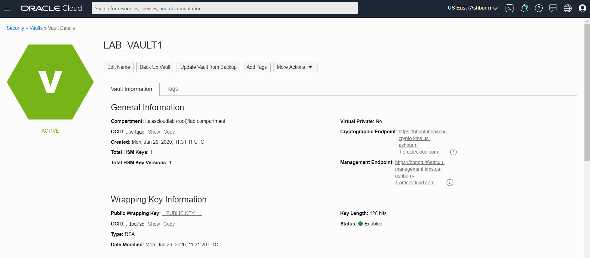

# Creating Vault in Console

Note: you should be aware before creating a Vault that it cannot be deleted instantly. When you delete a vault, the vault and all its associated keys go into a *pending deletion* state until the waiting period expires. By default, this is 30 days, but can be set from a minimum of 7 days up to a maximum of 30 days. When a vault is deleted, all its associated keys are also deleted. In terms of costs, it seems that you do not actually pay for the vault in teh pending deletion state.  
```
oci kms management vault create\
    --compartment-id $compartmentId \
    --display-name LAB_VAULT$LAB_ID \
    --vault-type DEFAULT
```{{execute}}

Check if the vault is listed in the list of vaults in the compartment:
```
oci kms management vault list --compartment-id $compartmentId
```{{execute}}

Let's retrieve the Vault's ocid into an environment variable:
```
vaults=$(oci kms management vault list -c $compartmentId)
export vaultOCID=$(echo $vaults | jq -r --arg display_name "LAB_VAULT$LAB_ID" '.data | map(select(."display-name" == $display_name)) | .[0] | .id')
export vaultManagementEndpoint=$(echo $vaults | jq -r --arg display_name "LAB_VAULT$LAB_ID" '.data | map(select(."display-name" == $display_name)) | .[0] | ."management-endpoint"')
echo "OCID for vault LAB_VAULT$LAB_ID = $vaultOCID "
```{{execute}}

To inspect the vault in the console:
`echo "Open the Console at this URL: https://console.${REGION}.oraclecloud.com/security/kms/vaults/${vaultOCID}"`{{execute}} 


