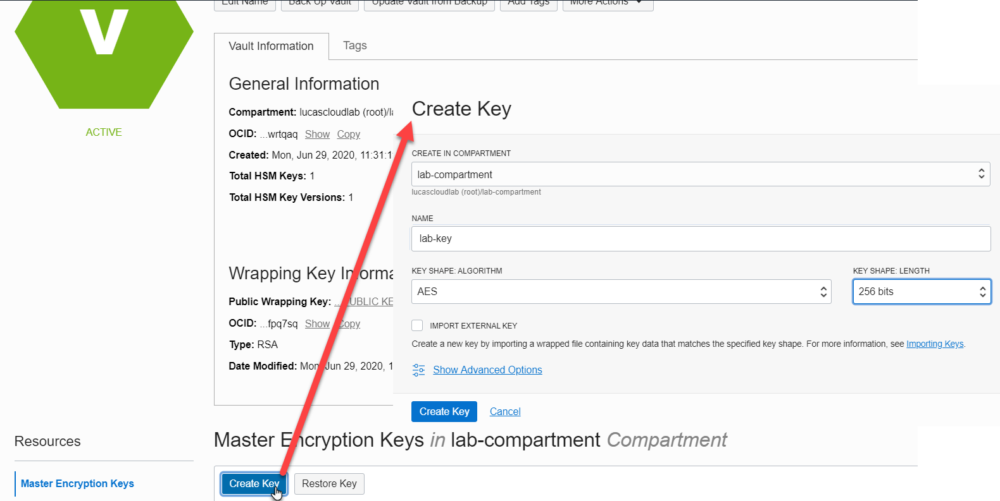

# Create a Key and use it for [En | De] Cryption

Creating a key that is used to encrypt and decrypt strings - or anything you want to have encrypted and decrypted - is best done in the console.

Please open the vault in the console:
`echo "Open the Console at this URL: https://console.${REGION}.oraclecloud.com/security/kms/vaults/${vaultOCID}"`{{execute}} 

Then create a new (Master Encryption) Key. Set the name to *lab-key*.


When the key is successfully created, return to the terminal window. Get the key's details:

`oci kms management key list -c $compartmentId --endpoint $vaultManagementEndpoint`{{execute}}

Let's retrieve the Key's ocid into an environment variable:
```
keys=$(oci kms management key list -c $compartmentId --endpoint $vaultManagementEndpoint)
export keyOCID=$(echo $keys | jq -r --arg display_name "lab-key" '.data | map(select(."display-name" == $display_name)) | .[0] | .id')
echo "OCID for vault lab-key = $keyOCID "
```{{execute}}

## Using the Key for some Encryption

The key can be used to encrypt any contents. Here we take the opening line from the novel Anna Karanenina, base64 encode it and encrypt it.   

```
toEncrypt=$(echo "Happy families are all alike,every unhappy family is unhappy in its own way." | base64)
# the next line removes the spaces from $toEncrypt variable 
toEncrypt=$(echo $toEncrypt| tr -d ' ')
encrypted=$(oci kms crypto encrypt --key-id $keyOCID --plaintext $toEncrypt --endpoint $vaultCryptoEndpoint)
export cipher=$(echo $encrypted | jq -r '.data | .ciphertext')
echo "This is the result of the encryption, a text that we can send anywhere and that no one will understand: $cipher"
```{{execute}}
The relevance of this encryption is of course that we now have a piece of content that we can unsafely transport and store. No one will be able to make heads or tails of it. Without the private key held in the OCI Vault, it is not currently possible to decipher this text. 

## Decrypting the Cipher

And now for some decryption magic: get a the original contents from this unreadable encrypted text, using the *decrypt* operation for the master key. Let's assume the cipher has traveled around the world, has been seen by many unworthy eyses. And no one could crack it. The only way to reveal its inner meaning is through the decryption operation in OCI (unless perhaps you have a very big computer and plenty of time and you can crack it).

Now is the time for decrypting the thing - using the key in the vault:

```
decrypted=$(oci kms crypto decrypt --key-id $keyOCID  --ciphertext $cipher --endpoint $vaultCryptoEndpoint)
export b64encodedPlaintext=$(echo $decrypted | jq -r '.data | .plaintext')
echo $b64encodedPlaintext | base64 --decode
```{{execute}}
First, the cipher is decrypted. The result is the base64 encoded plaintext that we can normally read when it is base64 decoded.

## Resources 
https://blogs.oracle.com/developers/protect-your-sensitive-data-with-secrets-in-the-oracle-cloud