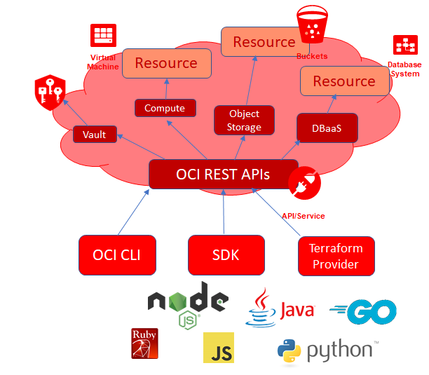
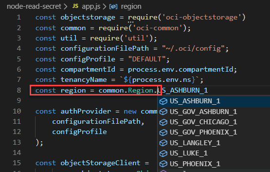

# Retrieve Secrets from Node Application

In this step, you will work with a Node application that retrieves the secret from the vault. This application uses the OCI SDK for TypeScript | JavaScript | Node to handle most of the work regarding composing and signing the REST API calls. The SDK still makes the REST calls under the hood - just like the CLI - and just as with the CLI are the details of these calls hidden from view.




```
mkdir node-read-secret
cd node-read-secret/
npm init -y
touch app.js
```{{execute}}

Then install the OCI SDK: 
`npm install oci-sdk --save`{{execute}}

Open *app.js* in the IDE. Paste the snippet below into file app.js.

<pre class="file" data-target="clipboard">
const objectstorage = require('oci-objectstorage')
const common = require('oci-common');
const util = require('util');
const configurationFilePath = "~/.oci/config";
const configProfile = "DEFAULT";
const compartmentId = process.env.compartmentId;
const tenancyName = `${process.env.ns}`;
const region = common.Region.US_ASHBURN_1

const authProvider = new common.ConfigFileAuthenticationDetailsProvider(
    configurationFilePath,
    configProfile
);

const objectStorageClient = 
      new objectstorage.ObjectStorageClient({
        authenticationDetailsProvider: authProvider
      });
objectStorageClient.region = region;

const listBucketsRequest = {
  namespaceName: tenancyName,
  compartmentId: compartmentId,
};
objectStorageClient.listBuckets(listBucketsRequest)
  .then((result) => {
    console.log(util.inspect(result, false, null, true));
  })
  .catch((e) => {
    console.log(e);
  });
</pre>


Make sure to update line 8 and set the correct region for your tenancy:


Run this little application that will show a list of all buckets in your tenancy:
`node app.js`{{execute}}

## Reading Secrets

Now we are going to extend the application with the capability to read a secret from a vault. Paste the following snippet at the bottom of the app.js file. 

<pre class="file" data-target="clipboard">
const secrets = require('oci-secrets')

const secretClient = 
      new secrets.SecretsClient
      ({
        authenticationDetailsProvider: authProvider
      });
secretClient.region = region;
secretClient.getSecretBundle({"secretId": process.env.secretOCID})
  .then((result) => {
    console.log(`Quest for Secrets ${util.inspect(result, false, null, true)}`);
    const secretContent = Buffer.from(result.secretBundle.secretBundleContent.content, 'base64').toString('ascii')
    console.log(`The secret is out: ${secretContent}`)
  })
  .catch((e) => {
    console.log(e);
  });
</pre>

New in this snippet is the *oci-secrets* library in the OCI Node SDK. A SecretsClient object is created using the *authProvider* that was also used with the storage service. On this SecretClients object, the method getSecretBundle() is invoked with the OCID of the secret we are interested in. From the result we can derive the base64 encoded content that can subsequently be bas64 decoded into the original string.

Run this little application that will show the secret that we created in the previous step (in addition to list of buckets in the object storage service):
`node app.js`{{execute}}

Two lessons can be learned:
* interacting with OCI APIs is much easier through the Node SDK than use of raw REST API requests
* retrieving secrets from an OCI vault in a Node application is quite straightforward

In the next step, we will create a Serverless Function that retrieves the secret. 

## Resources

[Protect Your Sensitive Data With Secrets In The Oracle Cloud](https://blogs.oracle.com/developers/protect-your-sensitive-data-with-secrets-in-the-oracle-cloud)
[OCI SDK for JavaScript/Node/TypeScript](https://blogs.oracle.com/developers/oci-sdk-for-typescript-is-now-available-heres-how-to-use-it)

[How to Implement an OCI API Gateway Authorization Fn in Node.js that Accesses OCI Resources](https://www.ateam-oracle.com/how-to-implement-an-oci-api-gateway-authorization-fn-in-nodejs-that-accesses-oci-resources)

[OCI SDK for Node/JS/TypeScript - Secrets Library - getSecretBundle](https://docs.cloud.oracle.com/en-us/iaas/tools/typescript/1.2.0/classes/_secrets_lib_client_.secretsclient.html)