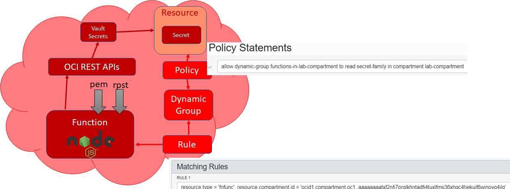

In this step you will create a function on OCI that reads a secret from the vault. We will make use in this example of the Resource Principal mechanism in OCI. This means that the function itself has permissions to access OCI services and resources, instead of leveraging permissions of an OCI user. Functions can become a Resource Principal when they are a member of a Dynamic Group. They inherit the permissions granted to the Dynamic Group through policies. When a function is a resource principal - the FaaS runtime framework injects a private key file and an RPST token file into the container that implements the function and sets two environment variables to refer to these files.  



In order to create a function that can read a secret, we have to:
* create a dynamic group of which the function will be a member
* through a policy [statement] grant permission to this group for reading secrets 
* create the function that reads the Private Key and RPST files references by the environment variables and uses their contents to sign requests to the OCI REST APIs 

## Dynamic Group and Policy 
Create dynamic group *functions-in-lab-compartment* that has all functions in compartment *lab-compartment* as member:

`oci iam dynamic-group create --compartment-id $TENANCY_OCID --name "functions-in-lab-compartment" --description "to collect all functions in compartment lab-compartment"  --matching-rule "[ \"ALL {resource.type = 'fnfunc', resource.compartment.id = '$compartmentId'}\"]" `{{execute}}

Create a policy that grants read access on secrets in the *lab-compartment* to all functions in that compartment :

```
oci iam policy create  --name "read-secret-permissions-for-resource-principal-enabled-functions-in-lab-compartment" --compartment-id $compartmentId  --statements "[ \"allow dynamic-group functions-in-lab-compartment to read secret-family in compartment lab-compartment\" ]" --description "to allow functions in lab-compartment to read secrets"
```{{execute}}


## Create Function Secret Retriever

Create new function *secret-retriever* using Node as the runtime: 
```
cd ~
fn init --runtime node secret-retriever
```{{execute}}

Change to the directory created for the function, with the familiar resources *func.js*, *func.yaml* and *package.json*; install the NPM module for the FN FDK

```
cd secret-retriever
npm install 
```{{execute}}

paste into func.js:
<pre class="file" data-target="clipboard">
const fdk = require('@fnproject/fdk');
const fs = require('fs')

fdk.handle(async function (input) {
    const rpst = fs.readFileSync(process.env.OCI_RESOURCE_PRINCIPAL_RPST, { encoding: 'utf8' })
    const payload = rpst.split('.')[1]
    const payloadDecoded = Buffer.from(payload, 'base64').toString('ascii')
    const claims = JSON.parse(payloadDecoded)
  
  return {
     'pem-file': process.env.OCI_RESOURCE_PRINCIPAL_PRIVATE_PEM
     ,'rpst-file' : process.env.OCI_RESOURCE_PRINCIPAL_RPST
     ,'rpst-claims' : claims
  }
})
</pre>

Deploy the function:

`fn -v deploy --app "lab$LAB_ID"`{{execute}}

Invoke the function:

`fn invoke "lab${LAB_ID}" secret-retriever --content-type application/json`{{execute}}

This will return evidence of the values injected into the function at run time by the Oracle Functions FaaS framework because of the Resource Principal configuration.

## Function Secret Retriever - and now for real!

We will now extend the function to do the job we have in mind for it: reading a secret from a vault.

Add these dependencies:

`npm install http-signature jssha install --save`{{execute}}

Copy this Node module to the function directory:
`cp /root/readSecret.js .`{{execute}}

Copy this snippet to file func.js - our implementation of the function wrapper geared towards reading a secret:

<pre class="file" data-target="clipboard">
const fdk = require('@fnproject/fdk');
const rs = require('./readSecret')
fdk.handle(async function (input) {
    const r = await rs.readSecret(input.secretOCID, input.compartmentOCID, input.region)
    return {
     'secret': r
    }
})
</pre>

Deploy the function:

`fn -v deploy --app "lab$LAB_ID"`{{execute}}

Invoke the function - to retrieve the value of the secret that was created in step 4:

`echo -n "{\"secretOCID\":\"${secretOCID}\", \"compartmentOCID\":\"${compartmentId}\", \"region\":\"${REGION}\"}" | fn invoke "lab${LAB_ID}" secret-retriever --content-type application/json`{{execute}}

This time, a secret really is read from the Vault and its value is included in the function's response.

## Resources

[How to Implement an OCI API Gateway Authorization Fn in Node.js that Retrieves Secrets from an OCI Vault and Accesses OCI Resources](https://www.ateam-oracle.com/how-to-implement-an-oci-api-gateway-authorization-fn-in-nodejs-that-accesses-oci-resources)

[Oracle Functions - Connecting from Java To An ATP Database With A Wallet Stored As Secrets](https://blogs.oracle.com/developers/oracle-functions-connecting-to-an-atp-database-with-a-wallet-stored-as-secrets)

[OCI SDK for Node/JS/TypeScript - Secrets Library - getSecretBundle](https://docs.cloud.oracle.com/en-us/iaas/tools/typescript/1.2.0/classes/_secrets_lib_client_.secretsclient.html)