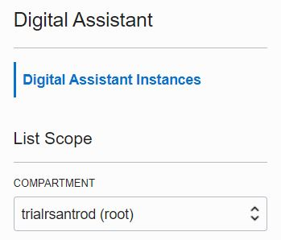

Once you click on it, on the following screen you will need to select a Compartment.

As explained in the past scenarios, a Compartment allows you to organize and isolate your cloud resources to control the access to those resources.

For this hands-on, you can select the root compartment. Then proceed to the next step!

