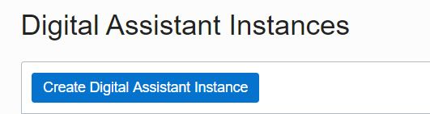
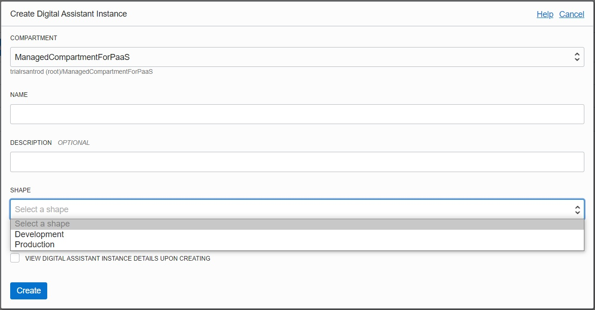

Now you can click on 'Create Digital Assistant Instance' button.

In the dialog, you have to mandatory fill name and shape.

1. For the name, you can add something that identifies your instance. In the screen you can see I named it 'odadev'.

2. For the shape, you have two options:

  * Development: minimum charge of 50 request per hour at the time of writing.

  * Production: minimum charge of 250 request per hour at the time of writing.

As you can see, the only difference is the number of requests and, for this hands-on, you can use the development shape so yoour credits will last longer.

Once you have filled the details click on 'Create'.