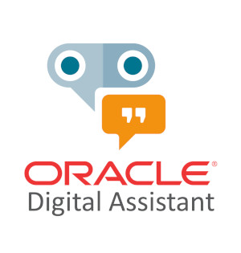

At the end of the next 4 scenarios you will have built your own Weather Assistant! 
Giving a location and optionally a date, the chatbot will consume a weather API to retrieve the weather information.

In these scenarios you will read a lot the word skill. An skill is an individual chatbots that are focused on specific tasks. The same way, you can have multiple skills in Alexa, in terms of Oracle Digital Asistant, you may have multiple skills within the same Digital Assistant (or Master Bot, as I like to call it).

In this first scenario you are going to define the intents needed for the skill and training the NLP model so the input provided is matched with the correct intent.