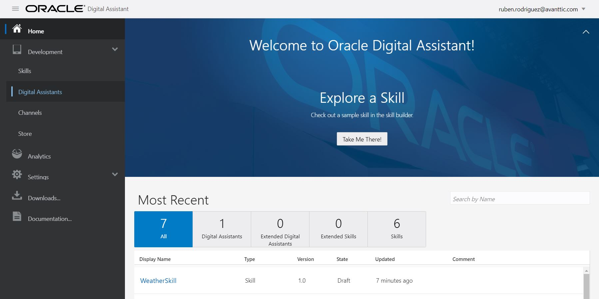
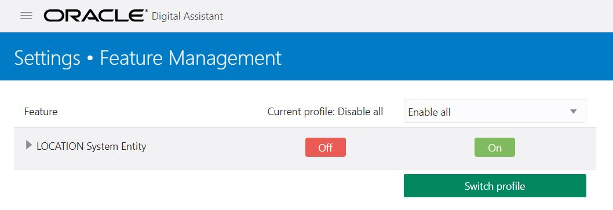

The last step of the first scenario was to access the ODA service console.

In ODA there is a feature mangement where you can enable or disable some of the new features that has been included in the product. In this case, a LOCATION entity has been recently included so you will enable it so you can use it in your skill. 

Click on the menu button on the top left side and click on Settings -> Feature Management.
At the moment if preparing this scenarios, the feature was disabled by default.

If it is enabled, you can proceed to the next step!
If it is disabled, you need to select from the dropdown list 'Enable all' and click on 'Switch profile' as you can see in the picture below.

