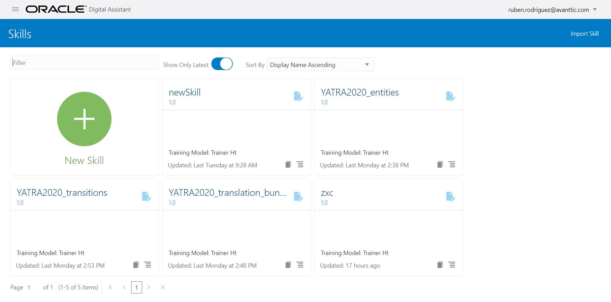
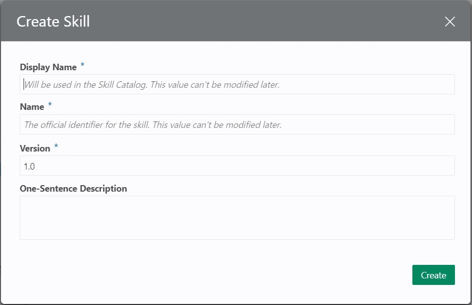

Now that LOCATION entity is available, you can create your skill.
On the main menu, click on Skills and you will see the list of skills (If it is the first time you access your environment it will be empty).

To create the skill click on 'New Skill' button. The following dialog will appear.

In the dialog fill the display name of your skill 'WeatherSkill' and click on 'Create' button