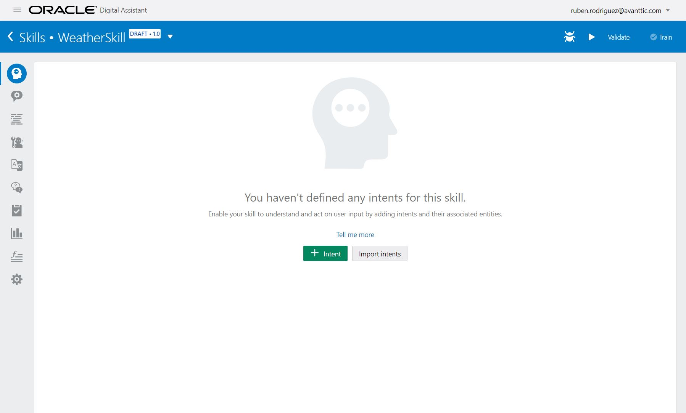
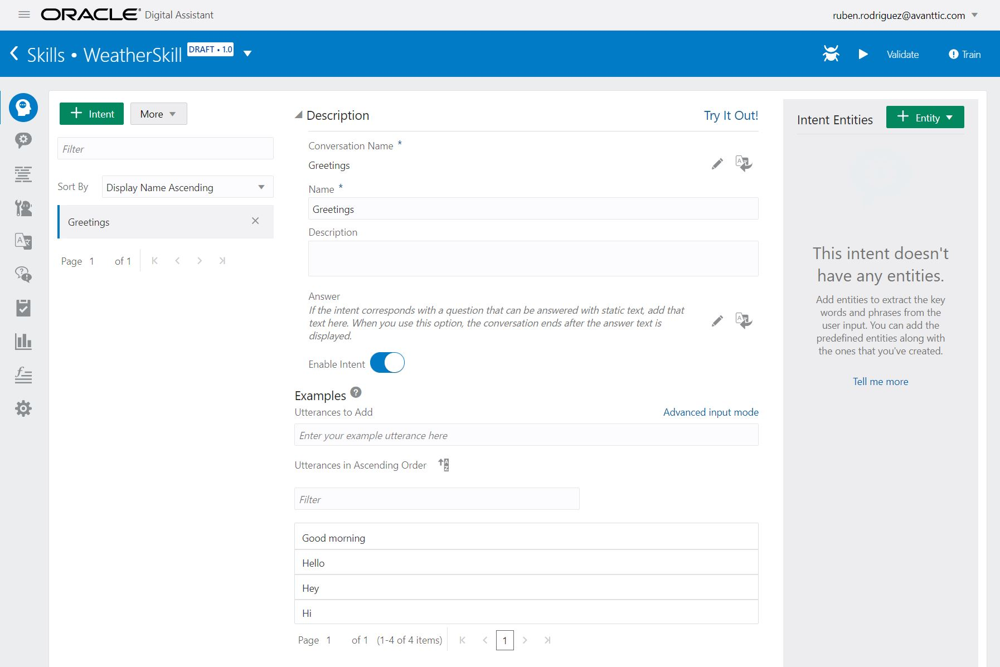

Now you can start creating the intents for your skill!
You will create three intents for your skill:
  * Greetings: Any chatbot has to be polite and reply accordingly to a 'Hello'. This is usefull to indicate what can you do for the user.
  * WeatherForecast: Main intent of the skill. 
  * Help: You would usually have a help intent in case the user does not know how to use the bot.

Let's start with Greetings Intent. Go to Intents page and click on '+ Intent'

Change Conversation Name, by clcking on the pencil to the right, and Name properties to Greetings.
Under Examples, enter the following utterances or phrase examples.

| Utterances    |
| ------------- |
| Good morning  |
| Hello         |
| Hey           |
| Hi            |

Now you have to repeat the process with the other two intents and the following utterances:

| Intent            | Utterances                                            |
|-------------------|-------------------------------------------------------|
| WeatherForecast   | is it raining in London                               |
|                   | what is the temperature in New York                   |
|                   | what's the weather forecast in Madrid for tomorrow    |
| Help              | I don't know how to use the bot                       |
|                   | I need help                                           |
|                   | What can I do                                         |

Once you have finished, you can move to the next step!