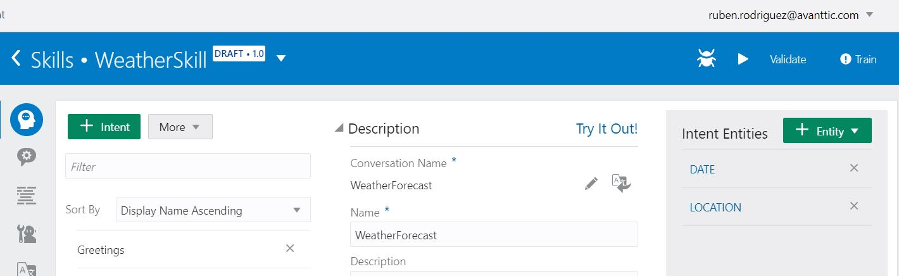

Itents are now completed but... you would normally ask the weather for a location and on a specific date or dates right? 
Before starting the intents testing is to associate LOCATION and DATE entities to WeatherForecast Intent.

Select WeatherForecast Intent and, on the right-hand side of the screen, click on '+ Entity' dropdown and select LOCATION and DATE entities.

