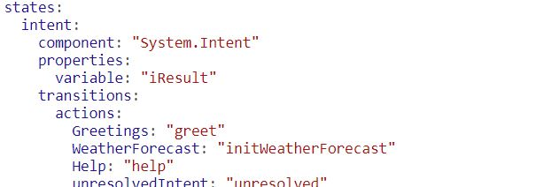

The next step after creating the intents is to implement the dialog flow, well not really, as you will need to define the dialog flow in advance of the implementation but it is for this hands-on.

As it was mentioned in the previous scenario, the dialog flow in Oracle Digital Assistance is implemented in YAML, you will be defining a set of states and transitions among them.
Everything is a state, starting sith the intent resolution and ending with the calls to external sources via custom components.

In this scenario you will implement the dialog flow for your skill and, as you have not implemented the REST call to OpenWeatherMap API, you will just set static data as response to the user requests.

