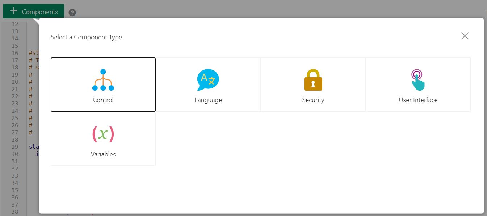

Click on the Flows menu.

First of all, theres a button '+ Components' where you have code snippets for all the components you cna add to the flow. This provides a baseline for the states you want to add, meaning you dont need to write every single like of code.

By default, the flow is initializated with an example. You can delete all the lines below 'states:' (in line 28) because you will be adding and understanding new code.

As you can see, YAML has 2 spaces indent. In the flow editor, you can tab and the cursor will move two spaces to the right.

Just below 'states:', andd the following code.
<pre>
    <code>
  intent:
    component: "System.Intent"
    properties:
      variable: "iResult"
    transitions:
      actions:
        Greetings: "greet"
        WeatherForecast: "initWeatherForecast"
        Help: "help"
        unresolvedIntent: "unresolved"
    </code>
</pre>
The 'intent' state is using a 'System.Intent' component. This component is the one that triggers the Intent resolution.

The variable iResult, thas is already defined in to top part of the flow of type 'nlpresult', is where the Intent resolution data is stored.

The transitions property is included in every single state and enables you to make the transition to other states. For example, in this case, if the intent matched is 'Greetings', the next state that will be executed is 'greet' state. The same with 'WeatherForecast' intent and 'initWeatherForecast' state.

You can have different types of transitions depending on the component:
  * next: The state specified is the next to be executed.
  * actions: Depending on the action one state will be executed.
  * return: Ends the conversation. All variable values are cleared unless those are stored in the user variable.
  * error: If there is an error on the state, it will transition to the specified state.

It is recommended that every state has a transition defined, but it is not mandatory. If you dont define it, the state execution order is top-bottom.