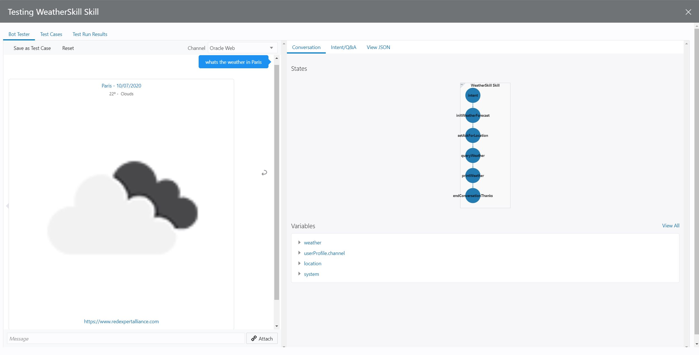

Implementation has been finished! Now it is time to test what you have implemented.

As you can see in the image below, theres three buttons.
* The bug button displays the rror that you might have in your flow definition.
* The play button opens a conversation tester.
* The 'Validate' button validates your flow definiton.

Feel free to click on 'Validate' to ensure that your flow does not have any error. 
Once it is validated, you can click on the play button.

On the left-hand side you can have a conversation with the bot, and on the right-hand side you have some information that let you debug your flow such as variable values, states history, etc.

You can try to play with it using different phrases, for example, the ones you used in the previous scenario.

| Phrases                                   |
| ------------------------------------------|
| What's the weather like?                  |
| is it snowing in Madrid?                  |
| Whats the weather in London for tomorrow? |

&nbsp;
&nbsp;
&nbsp;
&nbsp;

If you have missed something or the code is not working, you can get the full flow definition in the following link: [Scenario 3 Flow Definition](https://github.com/rsantrod/katacoda-scenarios/blob/master/oda-course/oda03-skill-flow-implementation/assets/flow.yaml)

&nbsp;
&nbsp;
&nbsp;
&nbsp;