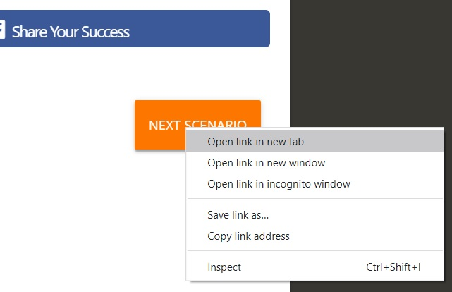

# DO NOT CLOSE THIS SCENARIO, open the next one in a new tab
In order to test the bot from the web widget you will need to have active the service that you just implemented and deployed.

There is a 60 minutes timeout on the environment, so this will be the time you have to complete scenario 5!

# Summary

Integration is key for any chatbot to provide the right information to the users or just to execute any transactional process of the enterprises.

In this scenario you have created your own Custom Component that is calling a REST API by using Node.js modules. 
One of the advantages of implementing the components in node.js here are a lot of modules that helps you solve common problems  

In the next, and last, scenario, you will use Oracle JavaScript SDK to expose your skill in a web site.

## Resources

[Oracle Digital Assistant - Backend Integration](https://docs.cloud.oracle.com/en-us/iaas/digital-assistant/doc/backend-integration1.html)

[Oracle Digital Assistant Enablement documentation](http://bit.ly/ODAEnablement)