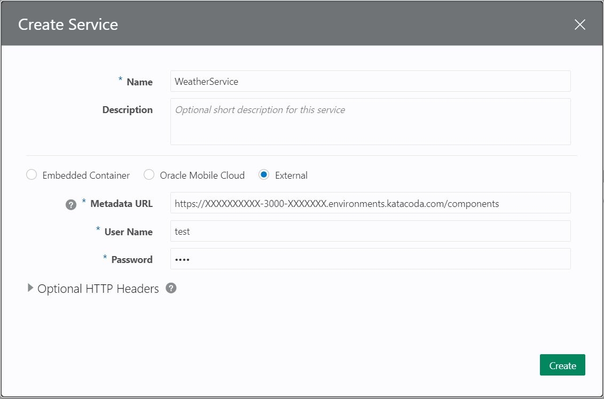
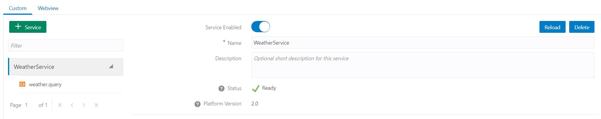
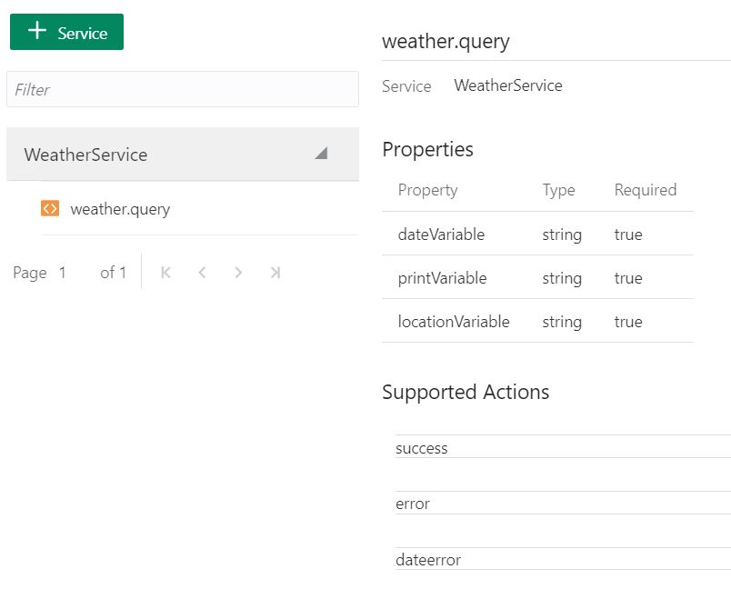

The implementation is now finished and you are ready to execute the service so it can be consumed from the dialogflow.
You will start the service in Katacoda by using:

`bots-node-sdk service -P 3000`{{execute}}

Now it is time to go back to Oracle Digital Assistant.
Inside of your Weather Skill, click on the  Components menu.

Click on '+ Service' button and the following dialgo will appear.

There are different ways of running custom components in ODA.
  * Embedded Container: You can upload the package to ODA.
  * Oracle Mobile Cloud: Stablish a connection with Oracle Mobile Hub.
  * External: You can connect to the component deployed in an external system. 

In this case you will be using External as the service is running in Katacoda.
Fill the dialog with the values below:
  * Name: WeatherService
  * Metadata URL: https://[[HOST_SUBDOMAIN]]-3000-[[KATACODA_HOST]].environments.katacoda.com/components
  * User Name: test
  * Password: test

It is mandatory to provide user name and password although you have not define one in your custom component.

The service is now created. If you make changes in the component definition, you will need to click on 'Reload' so the information is updated in ODA.

If you click on you component, 'weather.query' you will see the properties and actions defined.
