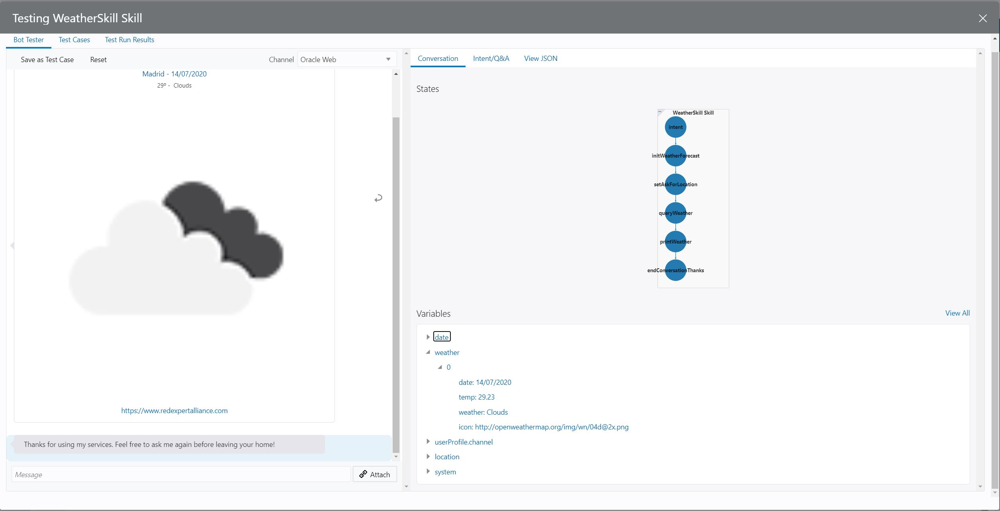

The skill implementation is now completed and you can now test it!

Click Verify button to check that everything is working fine and then click on the 'Play' button to open up the tester.

In the image above you can see, on the right-hand side that the different states the flow has executed includes 'printWeather', your custom component.
If you check bellow, in the variables list, under weather array, the first position has the data to be printed.

&nbsp;
&nbsp;
&nbsp;
&nbsp;

If you have missed something or the code is not working, you can get the full flow definition in the following link: [Scenario 4 Flow Definition](https://github.com/rsantrod/katacoda-scenarios/blob/master/oda-course/oda04-skill-custom-components/assets/flow.yaml)

&nbsp;
&nbsp;

And the working custom component code can be found in this link: [Scenario 4 Custom Component](https://github.com/rsantrod/katacoda-oda-weather-component)

&nbsp;
&nbsp;
&nbsp;
&nbsp;