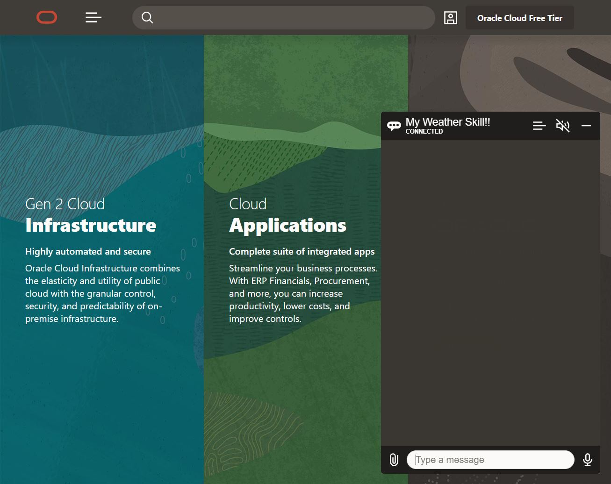

Oracle Digital Assistant (ODA) provides out of the box integration with some messaging platforms such as MS Teams, Facebook Messenger or Slack, and the hability to create your webhook to integrate other channels such as WhatsApp.
Moreover, ODA includes a set of widgets for native iOS and Android, and JavaScript that enables you to add a widget to any web or hybrid application.

This scenario will help you to setup and configure a web widget to expose the Skill you created in the past scenarios.

In order to successfully run this scenario and test the skill created, [scenario 4](https://www.katacoda.com/rsantrod/scenarios/oda04-skill-custom-components) has to be up and running as the Custom Component consumed from the ODA Skill is hosted in that katacoda environment.

