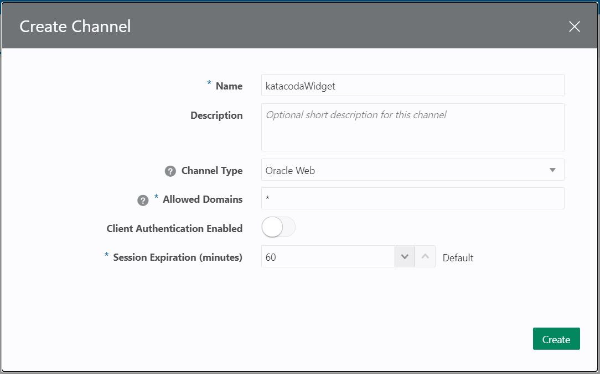

By clicking on '+ Channel' button you will see the creation dialog.

You have to fill the values like the picture above.

* Name: I suggest you to give it a name that identifies the place where you are going to set up the widget, not the skill that is going to be exposed itself.
* Channel Type: In this case, as we are setting it up on a web site, you have to choose 'Oracle Web'.
* Allowed Domains: You can restrict what domains can communicate with the channel, and you actually want to restrict this on a production environment. For the hands-on you can just set '*',
* Client Authentication Enabled: By enabling this flag, you enforce using JSON Web Tokens (JWT) that is used for communication between the client and the chat server. For the hands-on we will leave it disabled.
* Session Expiration: By default is set for its max value of 60 minutes.

Click on 'Create' button once you have filled all the information. 