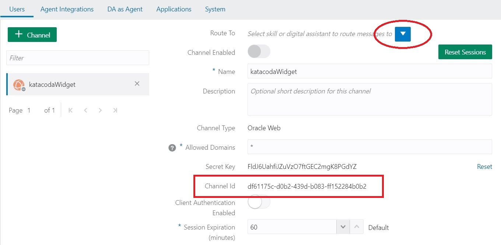
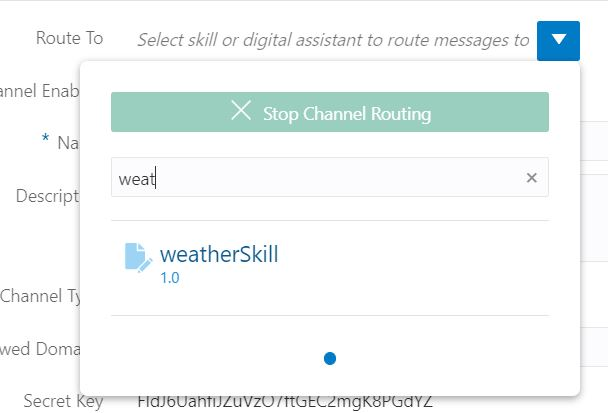
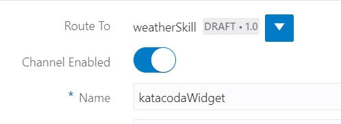

The channel has been successfully created but now we need to configure it as by default theres no skill associated and it is disabled as well.

**You need to save the Channel ID as this needs to be configured later in the scenario on the web widget.**

Click on the button maked in the picture above to associate the skill to the channel and select your weatherSkill as you can see in the picture below.

Now you just need to activate the channel.

