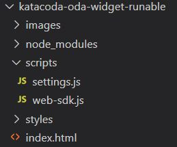

The configuration of the environment is now completed. Now you have to click on the IDE tab on Katacoda to start reviewing the different parts of the widget and configuring the ODA Channel.

As you can see in the image below, there are some folder and files that you will review during this process.

### index.html
This would be the page where you will display the widget. For example, if you want to display the widget in all the pages of your application you would include thse two script tags that you can see on lines 12 and 13.

<pre><code>
	13 &lt;script src="scripts/settings.js">&lt;/script>
	14 &lt;script src="scripts/web-sdk.js" onload="initSdk('Bots')">&lt;/script>
</code></pre>

### styles folder
There's nothing to do at this time for the hands-on, but you can override some of the css properties of the widget. You would need to add the css file to the index.html file as well.

<pre><code>
	&lt;link rel="stylesheet" href="styles/style.css"
</code></pre>

### scripts/web-sdk.js
You dont want to modify this file at all. It is the web sdk and all changes must be done via settings.js file.

### scripts/settings.js
This is the file where all the widget configuration is done, including the instance and channel details, and the customizations available
