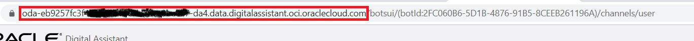

Now, lets review in settings.js file in a bit more detail as you will be modifying it.

The first few functions: mockApiCall, generateJWTToken and generateToken are a starting point in case you want to enforce client authentication in your channel, so you can ignore it for this hands-on.
As we are ignoring, or not enabling client authentication, you have to make sure that 'isClientAuthEnabled' is set to false.
<pre><code>
	4 const isClientAuthEnabled = false;
</code></pre>
Next part is where you will be making the widget customizations, function 'initSdk'.
First you need to modify 'ODA_URI' value with the host name of your instance. You can see an example below.

And, for 'channelID', you need the get de channelID from the channel you created in Step 3.
<pre><code>
	let chatWidgetSettings = {
		URI: 'ODA_URI',                    
		channelId: 'channelID',
		...
		...
	}
</code></pre>	

As an example of modifications, you are going to change the color of some elements.
For that, add to 'chatWidgetSettings' json the following property:

<pre><code>
	colors: {
		"branding": "green",
		"text": "green",
		'botMessageBackground': 'white'
	}
</code></pre>

Now you are ready to run the widget. Just execute the following commands.

`cd katacoda-oda-widget-runable`{{execute}}

`npm start`{{execute}}

Go to the 'Web Widget' tab to see the widget. 

Try to ask for the weather in your city!

There are multiple settings that can be overriden, and not just in terms of appearance. For example, we will send a hidden message to trigger Greetings Intent so the bot greets the user instead of the user having to say hello.

Add to 'chatWidgetSettings' json the following property:
<pre><code>
	initUserHiddenMessage: "hello"
</code></pre>

To test the change made, go to the Terminal tab and make Ctrl + C to stop the process and execute again:

`npm start`{{execute}}

Go back to the 'Web Widget' tab and click on refresh button next to the tab name.
When opening the widget you will see the massages from the bot.

<pre>
You can see the full list of available customizations on the user-guide.md file in VSCode tab.
</pre>

